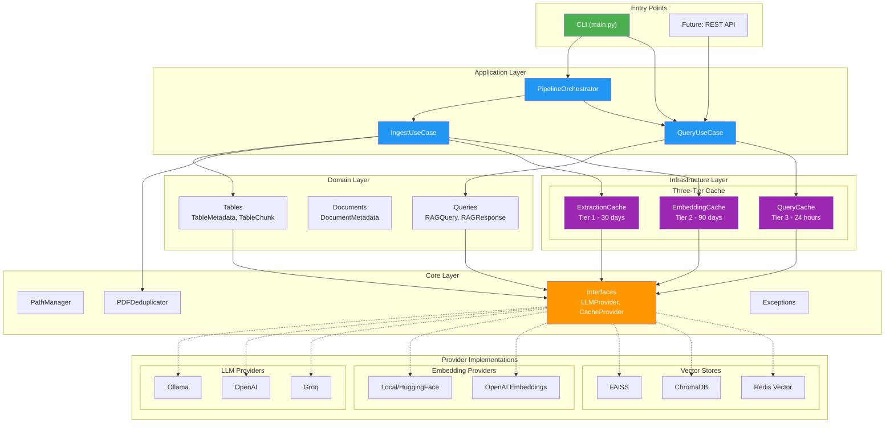
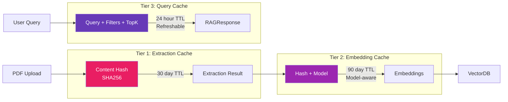
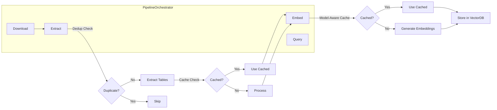
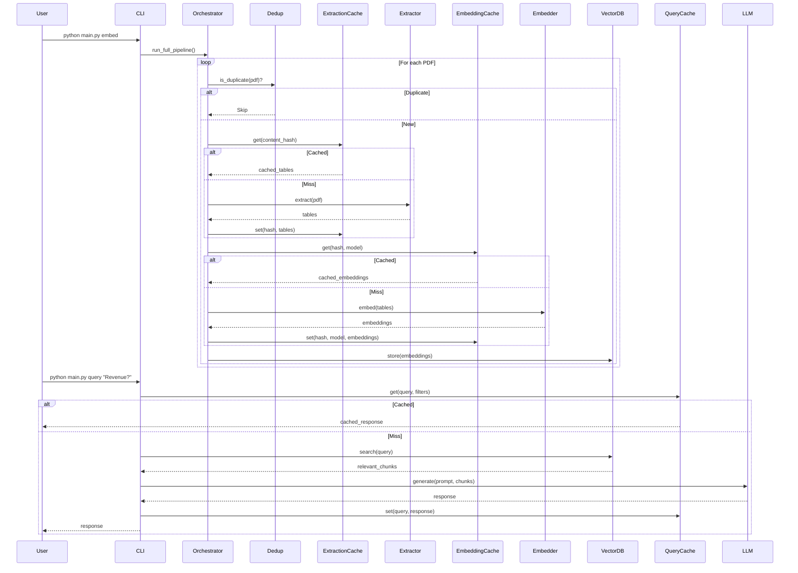

# Enterprise RAG System Architecture

> **Version:** 2.1.0 | **Updated:** December 5, 2025

## Overview

This system follows **Clean Architecture** principles with a layered, decoupled design that enables:

- 🔌 **Plug-and-Play Components** - Swap LLM, embedding, or vector DB providers without code changes
- 📦 **Modular Scaling** - Each layer scales independently
- 🧪 **Testability** - Interfaces enable easy mocking
- 🔄 **Future-Proof** - Add new providers via interfaces

---

## Architecture Diagram



---

## Layer Descriptions

### 🟢 Core Layer (`src/core/`)

The **shared kernel** - zero external dependencies within the project.

| Module | Purpose |
|--------|---------|
| `paths.py` | Cross-platform path management using `pathlib` |
| `deduplication.py` | SHA256 content-hash PDF deduplication |
| `exceptions.py` | Centralized exception hierarchy |
| `interfaces/` | Python Protocols for dependency injection |

**Key Principle:** Core never imports from other layers.

---

### 🔵 Domain Layer (`src/domain/`)

**Business entities** - pure data models with validation.

```
domain/
├── tables/       # TableMetadata, TableChunk, FinancialTable
├── documents/    # DocumentMetadata, PageLayout, Period
└── queries/      # RAGQuery, RAGResponse, SearchResult
```

**Key Principle:** Domain entities have no infrastructure dependencies.

---

### 🟣 Infrastructure Layer (`src/infrastructure/`)

**External integrations** and caching.

#### Three-Tier Caching System



| Cache | Key | TTL | Features |
|-------|-----|-----|----------|
| **Extraction** | Content SHA256 | 30 days | Survives file renames |
| **Embedding** | Hash + Model | 90 days | Invalidates on model change |
| **Query** | Query + Filters | 24 hours | `force_refresh` option |

---

### 🟠 Application Layer (`src/application/`)

**Use cases** that orchestrate domain + infrastructure.

```python
# QueryUseCase - handles query caching automatically
from src.application import get_query_use_case

uc = get_query_use_case()
response = uc.query("What was revenue?", force_refresh=False)
print(f"From cache: {response.from_cache}")
```

---

### ⚙️ Pipeline Layer (`src/pipeline/`)

**Orchestration** with modular steps.



---

## Provider Plug-and-Play

The system uses **Protocol interfaces** for true plug-and-play:

```python
# src/core/interfaces/provider.py
class LLMProvider(Protocol):
    def generate(self, prompt: str) -> str: ...
    def get_model_name(self) -> str: ...

class EmbeddingProvider(Protocol):
    def embed(self, text: str) -> List[float]: ...
    def get_dimension(self) -> int: ...

class VectorStoreProvider(Protocol):
    def add(self, chunks: List[TableChunk]) -> None: ...
    def search(self, query: str, top_k: int) -> List[SearchResult]: ...
```

### Switching Providers

```bash
# .env - Just change the provider name
LLM_PROVIDER=ollama        # or openai, groq
EMBEDDING_PROVIDER=local   # or openai
VECTORDB_PROVIDER=faiss    # or chroma, redis
```

**No code changes required!**

---

## Data Flow



---

## Directory Structure

```
GENAI/
├── src/
│   ├── core/                    # 🟢 Shared Kernel
│   │   ├── paths.py             # Cross-platform paths
│   │   ├── deduplication.py     # PDF content dedup
│   │   ├── exceptions.py        # Exception hierarchy
│   │   └── interfaces/          # Protocol definitions
│   │
│   ├── domain/                  # 🔵 Business Entities
│   │   ├── tables/              # Table entities
│   │   ├── documents/           # Document entities
│   │   └── queries/             # Query/Response entities
│   │
│   ├── infrastructure/          # 🟣 External Adapters & Providers
│   │   ├── cache/               # Three-tier caching
│   │   │   ├── extraction_cache.py  # Tier 1
│   │   │   ├── embedding_cache.py   # Tier 2
│   │   │   └── query_cache.py       # Tier 3
│   │   ├── llm/                 # LLM Providers (Ollama, OpenAI, Groq)
│   │   ├── embeddings/          # Embedding Providers (Local, OpenAI)
│   │   ├── vectordb/            # Vector Stores (FAISS, Chroma, Redis)
│   │   └── extraction/          # PDF Extractors (Docling, PyMuPDF)
│   │
│   ├── application/             # 🟠 Use Cases
│   │   └── use_cases/           # IngestUseCase, QueryUseCase
│   │
│   ├── pipeline/                # ⚙️ Orchestration
│   │   ├── orchestrator.py      # Pipeline coordinator
│   │   └── steps/               # Modular steps
│   │
│   ├── rag/                     # RAG Query Engine
│   ├── retrieval/               # Search & Retrieval
│   ├── cache/                   # Redis Cache (legacy compat)
│   └── models/                  # Schemas (legacy compat)
│
├── config/
│   ├── settings.py              # Pydantic settings (.env)
│   ├── loader.py                # YAML config loader
│   ├── paths.yaml               # Directory paths
│   ├── logging.yaml             # Enterprise logging
│   ├── providers.yaml           # LLM/Embedding/VectorDB
│   ├── prompts.yaml             # Prompt templates
│   └── environments/            # Per-environment configs
│       ├── dev.yaml
│       ├── prod.yaml
│       └── test.yaml
│
├── main.py                      # CLI entry point
└── .env                         # Provider configuration
```

---

## Key Design Decisions

### 1. **Why Protocol Interfaces?**
- Runtime duck-typing (no abstract base classes)
- Easy mocking for tests
- True dependency inversion

### 2. **Why Three-Tier Caching?**
- **Tier 1** saves expensive PDF extraction (~30s/doc)
- **Tier 2** saves embedding API costs and time
- **Tier 3** instant response for repeated queries

### 3. **Why Content-Hash Deduplication?**
- Files renamed? Still detected as duplicate
- No redundant processing
- History persists across runs

### 4. **Why Modular Pipeline Steps?**
- Each step testable in isolation
- Easy to add new steps
- Metrics per step

---

## Future Extensions

The architecture supports:

| Extension | How to Add |
|-----------|------------|
| **REST API** | Add FastAPI routes calling `QueryUseCase` |
| **Chat Interface** | Add `ChatUseCase` in application layer |
| **New LLM** | Implement `LLMProvider` protocol |
| **New VectorDB** | Implement `VectorStoreProvider` protocol |
| **Async Processing** | Add async versions of interfaces |
| **Kubernetes** | Each layer can be a separate service |

---

## Quick Start

```python
# Using the enterprise pipeline
from src.pipeline import get_pipeline

pipeline = get_pipeline()

# Run full ingestion with caching + dedup
result = pipeline.run_full_pipeline(source_dir="raw_data")
print(f"Metrics: {pipeline.get_metrics()}")
print(f"Cache stats: {pipeline.get_cache_stats()}")

# Or use high-level use cases
from src.application import get_query_use_case

uc = get_query_use_case()
response = uc.query("What was Q1 2025 revenue?", force_refresh=False)
print(f"Answer: {response.answer}")
print(f"From cache: {response.from_cache}")
```

---

## Summary

| Aspect | Design Choice |
|--------|--------------|
| **Architecture** | Clean Architecture (Onion) |
| **Coupling** | Loosely coupled via interfaces |
| **Scalability** | Horizontal (each layer independent) |
| **Extensibility** | Plug-and-play via Protocols |
| **Caching** | Three-tier with LRU eviction |
| **Testing** | Interface mocking, isolated steps |
