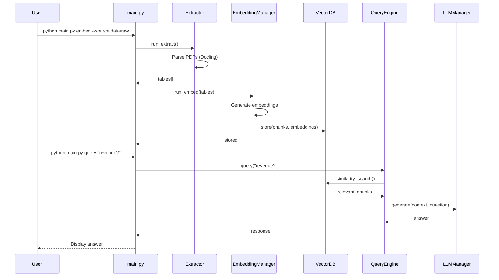

# GENAI System Architecture

## Module Diagram

```mermaid
graph TB
    subgraph "Entry Points"
        MAIN[main.py]
        RUN[run_complete_pipeline.py]
    end
    
    subgraph "src/application"
        UC_QUERY[use_cases/query.py]
        UC_INGEST[use_cases/ingest.py]
    end
    
    subgraph "src/pipeline"
        ORCH[orchestrator.py]
        DOWNLOAD[steps/download.py]
        EXTRACT[steps/extract.py]
        EMBED[steps/embed.py]
        SEARCH[steps/search.py]
        QUERY[steps/query.py]
    end
    
    subgraph "src/rag"
        RAG_PIPE[pipeline.py - QueryEngine]
        EXPORTER[exporter.py]
    end
    
    subgraph "src/retrieval"
        RETRIEVER[retriever.py]
        QUERY_PROC[query_processor.py]
        subgraph "search/"
            ORCHESTRATOR[orchestrator.py]
            VECTOR[strategies/vector_search.py]
            HYBRID[strategies/hybrid_search.py]
            KEYWORD[strategies/keyword_search.py]
        end
    end
    
    subgraph "src/infrastructure"
        subgraph "vectordb/"
            VDB_MGR[manager.py]
            FAISS[stores/faiss_store.py]
            CHROMA[stores/chromadb_store.py]
            REDIS[stores/redis_store.py]
        end
        
        subgraph "embeddings/"
            EMB_MGR[manager.py]
            LOCAL[providers/local]
            OPENAI_EMB[providers/openai]
            CUSTOM[providers/custom_api]
        end
        
        subgraph "llm/"
            LLM_MGR[manager.py]
            OLLAMA[providers/ollama]
            OPENAI_LLM[providers/openai]
        end
        
        subgraph "extraction/"
            EXTRACTOR[extractor.py]
            DOCLING[backends/docling]
            PYMUPDF[backends/pymupdf]
            PDFPLUMBER[backends/pdfplumber]
            subgraph "formatters/"
                EXCEL_EXP[excel_exporter.py]
                CONSOL_EXP[consolidated_exporter.py]
                HEADER_DET[header_detector.py]
                DATE_UTILS[date_utils.py]
                EXCEL_UTILS[excel_utils.py]
            end
        end
        
        subgraph "cache/"
            CACHE_BASE[base.py]
            EXT_CACHE[extraction_cache.py]
            EMB_CACHE[embedding_cache.py]
            QUERY_CACHE[query_cache.py]
        end
        
        subgraph "observability/"
            TRACING[tracing.py - LangSmith]
        end
    end
    
    subgraph "src/domain"
        TABLES[tables/entities.py]
        QUERIES[queries/entities.py]
        DOCS[documents/entities.py]
    end
    
    subgraph "src/core"
        EXCEPTIONS[exceptions.py]
        PATHS[paths.py]
        DEDUP[deduplication.py]
    end
    
    MAIN --> DOWNLOAD
    MAIN --> EXTRACT
    MAIN --> EMBED
    MAIN --> SEARCH
    MAIN --> QUERY
    
    EXTRACT --> EXTRACTOR
    EMBED --> EMB_MGR
    EMBED --> VDB_MGR
    SEARCH --> RETRIEVER
    QUERY --> RAG_PIPE
    
    RAG_PIPE --> RETRIEVER
    RAG_PIPE --> LLM_MGR
    
    VDB_MGR --> FAISS
    VDB_MGR --> CHROMA
    VDB_MGR --> REDIS
    
    EXTRACTOR --> DOCLING
    EXTRACTOR --> PYMUPDF
    
    classDef domain fill:#e1f5fe
    classDef infra fill:#fff3e0
    classDef core fill:#f3e5f5
    
    class TABLES,QUERIES,DOCS domain
    class FAISS,CHROMA,REDIS,EMB_MGR,LLM_MGR,EXTRACTOR infra
    class EXCEPTIONS,PATHS,DEDUP core
```



---

## Layer Responsibilities

| Layer | Location | Purpose |
|-------|----------|---------|
| **Entry** | `main.py`, `run_complete_pipeline.py` | CLI, orchestration |
| **Application** | `src/application/` | Use cases (query, ingest) |
| **Pipeline** | `src/pipeline/` | Step-by-step processing |
| **RAG** | `src/rag/` | Query engine, LCEL chains |
| **Retrieval** | `src/retrieval/` | Search strategies, ranking |
| **Infrastructure** | `src/infrastructure/` | External integrations |
| **Domain** | `src/domain/` | Business entities |
| **Core** | `src/core/` | Exceptions, paths, utils |

---

## Error Handling Pattern

All modules follow consistent try-catch with logging:

```python
from src.utils import get_logger
from src.core.exceptions import ExtractionError

logger = get_logger(__name__)

def extract_tables(pdf_path: str):
    try:
        # Business logic
        result = process(pdf_path)
        logger.info(f"Extracted tables from {pdf_path}")
        return result
    except ExtractionError as e:
        logger.error(f"Extraction failed: {e}")
        raise
    except Exception as e:
        logger.error(f"Unexpected error: {e}")
        raise ExtractionError(f"Failed to extract: {e}")
```

**Exception Hierarchy:**
```
GENAIException (base)
├── ExtractionError
├── EmbeddingError
├── VectorStoreError
├── LLMError
├── RAGError
├── CacheError
└── ConfigurationError
```

---

## Logging Configuration

**Location:** `.logs/` directory

| File | Level | Content |
|------|-------|---------|
| `genai_YYYYMMDD.log` | DEBUG+ | All logs with detailed format |
| `genai_errors_YYYYMMDD.log` | ERROR+ | Errors only |

**Format:**
```
2025-12-06 23:00:00 - genai.module - INFO - [file.py:42] - Message
```

---

## Data Flow


