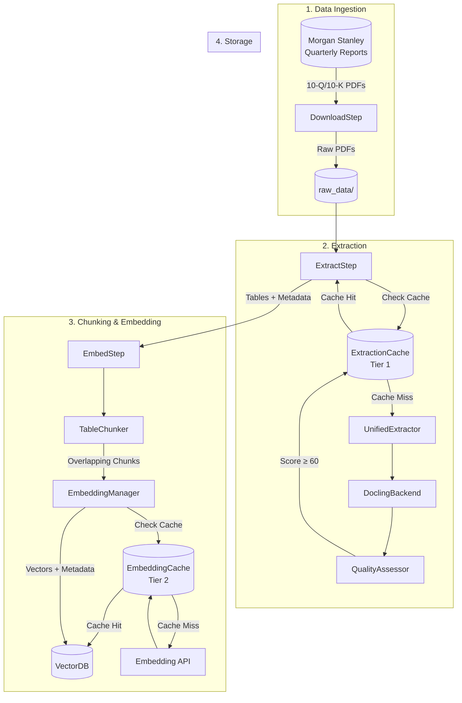
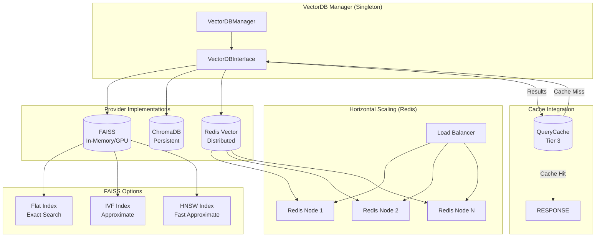
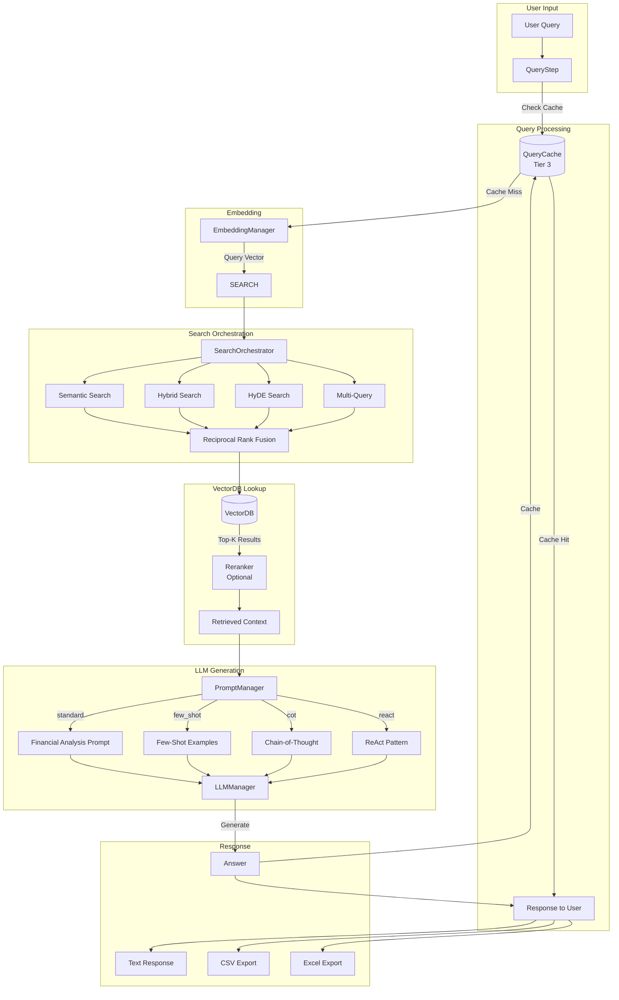
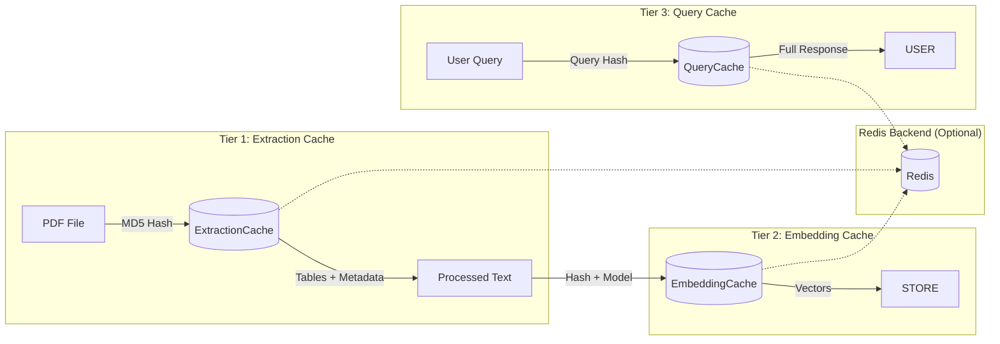
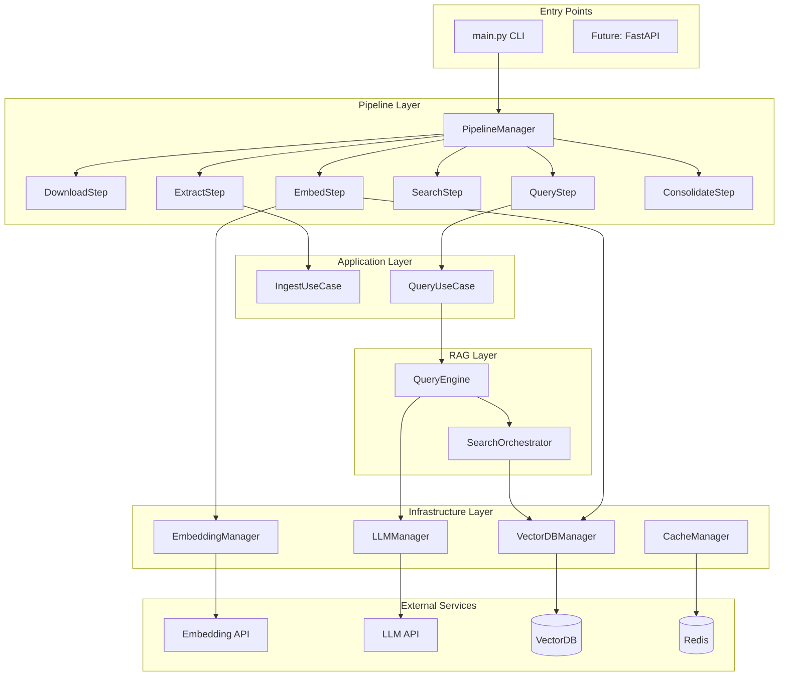

# GENAI System Architecture Diagrams

## 1. Data Processing Pipeline



### Data Flow Details

| Step | Input | Output | Cache |
|------|-------|--------|-------|
| **Download** | URL patterns | PDF files | — |
| **Extract** | PDF files | Tables + Metadata | ExtractionCache (content hash) |
| **Chunk** | Tables | Overlapping chunks (10 rows, 3 overlap) | — |
| **Embed** | Text chunks | 768/1536-dim vectors | EmbeddingCache (text hash + model) |
| **Store** | Vectors + Metadata | VectorDB entries | — |

---

## 2. VectorDB Architecture



### VectorDB Provider Comparison

| Provider | Use Case | Scaling | Performance |
|----------|----------|---------|-------------|
| **FAISS** | Single instance, GPU | Vertical (GPU) | Fastest search |
| **ChromaDB** | Persistent, small-medium | Single node | Good, persistent |
| **Redis Vector** | Distributed, large scale | Horizontal (cluster) | Network latency |

### Metadata Stored

```
TableMetadata:
├── source_doc, table_id, chunk_reference_id
├── company_name, ticker, year, quarter
├── table_title, table_type, statement_type
├── page_no, row_count, column_count
├── embedding_model, embedding_provider
└── extraction_timestamp
```

---

## 3. User Query Flow



### Query Flow Details

| Stage | Component | Cache | Fallback |
|-------|-----------|-------|----------|
| **Query Input** | QueryStep | QueryCache (Tier 3) | — |
| **Embedding** | EmbeddingManager | EmbeddingCache (Tier 2) | Sequential API |
| **Search** | SearchOrchestrator | — | Multiple strategies |
| **VectorDB** | VectorDBManager | — | Configurable provider |
| **LLM** | LLMManager | — | Ollama/OpenAI/Custom |
| **Response** | QueryEngine | QueryCache | — |

### Prompt Strategies

| Strategy | Use Case | Template |
|----------|----------|----------|
| **standard** | General financial queries | `FINANCIAL_CHAT_PROMPT` |
| **few_shot** | Complex analysis | 21 examples in `prompts.yaml` |
| **cot** | Multi-step reasoning | `COT_PROMPT` |
| **react** | Tool-using queries | `REACT_PROMPT` |

---

## 4. Caching Architecture (Three Tiers)



### Cache Benefits

| Tier | Skip If Cached | Speed Improvement |
|------|----------------|-------------------|
| **Tier 1** | PDF extraction | 10-30 seconds/file |
| **Tier 2** | Embedding API calls | 100-500ms/chunk |
| **Tier 3** | Full RAG pipeline | 2-5 seconds/query |

---

## 5. Complete System Overview



---

## What's Covered

| Area | Diagrams Include |
|------|------------------|
| ✅ Data Processing | Download → Extract → Chunk → Embed → Store |
| ✅ Caching | Three-tier (Extraction, Embedding, Query) |
| ✅ VectorDB | FAISS, ChromaDB, Redis + horizontal scaling |
| ✅ Query Flow | Embedding → Search strategies → Reranking |
| ✅ LLM Integration | Multiple prompt strategies |
| ✅ Response Formats | Text, CSV, Excel exports |
| ✅ Consolidation | Table aggregation across quarters |
