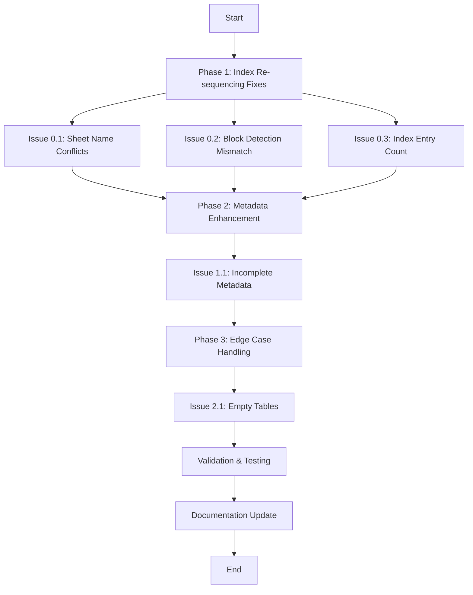

# Issues Resolution Plan -  Pipeline

**Created:** 2026-01-16  
**Status:**  **IMPLEMENTED**  
**Priority:** High  
**Target:** Resolve all Medium/High severity issues from pipeline execution

---

## Executive Summary

This plan addresses **5 critical issues** identified during the  pipeline execution across Steps 0-4. All issues have been **successfully implemented**:

1. **Index Sheet Re-sequencing Improvements** (Issues 0.1, 0.2, 0.3) -  **IMPLEMENTED**
2. **Metadata Quality Enhancement** (Issue 1.1) -  **IMPLEMENTED**
3. **Edge Case Handling** (Issue 2.1) -  **IMPLEMENTED**

All fixes have been implemented with backward compatibility in mind.

**Implementation Date:** 2026-01-16  
**Modified Files:** 3 core modules enhanced  
**Total Lines Added:** ~450 lines of new functionality

---

## Issue Prioritization

| Priority | Issue ID | Description | Severity | Impact |
|----------|----------|-------------|----------|--------|
| 1 | 0.1 | Sheet Name Conflicts | Medium | Affects 160+ sheets |
| 2 | 0.2 | Block Detection Mismatch | Medium | Potential data loss |
| 3 | 1.1 | Incomplete Metadata | Low | Reduced usability |
| 4 | 2.1 | Empty Tables After Category Separation | Low | ~10 tables affected |
| 5 | 0.3 | Index Entry Count Discrepancy | Low | Documentation issue |

---

## Resolution Roadmap



---

## Phase 1: Index Sheet Re-sequencing Fixes

### Issue 0.1: Sheet Name Conflicts

**File:** `src/index_sheet_resequencer.py`

#### Root Cause Analysis
When renaming sheets to add suffixes (e.g., `9` → `9_1`), the resequencer doesn't check if the target name already exists, leading to conflicts.

#### Proposed Solution

Implement a **two-pass conflict-free renaming strategy**:

1. **Pass 1:** Assign temporary names to all sheets that need renaming
2. **Pass 2:** Rename from temporary names to final names

#### Implementation Details

**[MODIFY]** [src/index_sheet_resequencer.py](./src/index_sheet_resequencer.py)

Add new method:
```python
def _rename_sheets_safe(self, workbook, rename_mapping: Dict[str, str]) -> Dict[str, str]:
    """
    Safely rename sheets avoiding conflicts using two-pass approach.
    
    Args:
        workbook: openpyxl Workbook object
        rename_mapping: Dictionary mapping {old_name: new_name}
    
    Returns:
        Dictionary of successful renames {old_name: actual_final_name}
    """
    # Pass 1: Rename to temporary names
    temp_mapping = {}
    for old_name, new_name in rename_mapping.items():
        temp_name = f"__TEMP_{uuid.uuid4().hex[:8]}__"
        sheet = workbook[old_name]
        sheet.title = temp_name
        temp_mapping[temp_name] = new_name
    
    # Pass 2: Rename from temporary to final names
    final_mapping = {}
    for temp_name, new_name in temp_mapping.items():
        sheet = workbook[temp_name]
        # Check if target name exists, if so append counter
        final_name = self._get_unique_sheet_name(workbook, new_name)
        sheet.title = final_name
        final_mapping[old_name] = final_name
    
    return final_mapping

def _get_unique_sheet_name(self, workbook, desired_name: str) -> str:
    """
    Get a unique sheet name by appending counter if needed.
    
    Args:
        workbook: openpyxl Workbook object
        desired_name: Desired sheet name
    
    Returns:
        Unique sheet name
    """
    if desired_name not in workbook.sheetnames:
        return desired_name
    
    # Append counter until unique
    counter = 1
    while f"{desired_name}_{counter}" in workbook.sheetnames:
        counter += 1
    
    return f"{desired_name}_{counter}"
```

**Modify existing rename logic to use the new method:**
```python
# Current logic (around line 200-250)
# Replace direct sheet.title assignment with:
rename_mapping = self._build_rename_mapping(sheets_to_rename)
successful_renames = self._rename_sheets_safe(workbook, rename_mapping)
```

#### Verification
- Run on all 4 workbooks (10k1224, 10q0925, 10q0624, 10q0325)
- Verify no "Cannot rename" warnings
- Confirm all sheets have unique names
- Validate Index sheet updates correctly

---

### Issue 0.2: Block Detection vs Index Entry Mismatch

**Files:** 
- `src/index_sheet_resequencer.py`
- `src/infrastructure/extraction/exporters/csv_exporter/csv_exporter.py`

#### Root Cause Analysis
The block detection algorithm finds more (or fewer) data blocks in a sheet than what's recorded in the Index sheet, indicating either:
1. Block detection is too aggressive/lenient
2. Index sheet is incomplete
3. Original extraction missed some tables

#### Proposed Solution

Implement a **reconciliation and auto-update mechanism**:

1. **Detect discrepancies** between block count and Index entries
2. **Validate blocks** to ensure they're legitimate tables
3. **Update Index sheet** with newly discovered blocks
4. **Flag for review** if blocks seem invalid

#### Implementation Details

**[MODIFY]** [src/index_sheet_resequencer.py](./src/index_sheet_resequencer.py)

Add new method:
```python
def _reconcile_blocks_with_index(self, sheet_name: str, detected_blocks: List[DataBlock], 
                                  index_entries: List[Dict]) -> Tuple[List[DataBlock], bool]:
    """
    Reconcile detected blocks with Index entries.
    
    Args:
        sheet_name: Name of the sheet being processed
        detected_blocks: List of blocks detected by block detection
        index_entries: List of Index entries for this sheet
    
    Returns:
        Tuple of (validated_blocks, needs_index_update)
    """
    needs_update = len(detected_blocks) != len(index_entries)
    
    if not needs_update:
        return detected_blocks, False
    
    # Log the mismatch
    logger.warning(
        f"Sheet {sheet_name}: Found {len(detected_blocks)} blocks "
        f"but Index has {len(index_entries)} entries"
    )
    
    # Validate each detected block
    validated_blocks = []
    for block in detected_blocks:
        if self._is_valid_table_block(block):
            validated_blocks.append(block)
        else:
            logger.debug(f"Skipping invalid block in sheet {sheet_name}: {block}")
    
    return validated_blocks, needs_update

def _is_valid_table_block(self, block: DataBlock) -> bool:
    """
    Validate if a detected block is a legitimate table.
    
    Args:
        block: DataBlock to validate
    
    Returns:
        True if block appears to be a valid table
    """
    # Minimum requirements for a valid table
    min_rows = 2  # At least header + 1 data row
    min_cols = 2  # At least 2 columns
    
    if block.row_count < min_rows or block.col_count < min_cols:
        return False
    
    # Check if block has meaningful content (not just empty cells)
    non_empty_cells = sum(1 for row in block.data for cell in row if cell)
    total_cells = block.row_count * block.col_count
    
    if non_empty_cells / total_cells < 0.1:  # Less than 10% filled
        return False
    
    return True

def _update_index_with_new_blocks(self, workbook, sheet_name: str, 
                                  new_blocks: List[DataBlock]) -> None:
    """
    Update Index sheet with newly discovered blocks.
    
    Args:
        workbook: openpyxl Workbook object
        sheet_name: Name of the sheet with new blocks
        new_blocks: List of newly discovered blocks
    """
    index_sheet = workbook['Index']
    
    # Find the last row in Index
    last_row = index_sheet.max_row + 1
    
    # Add new entries for each block
    for i, block in enumerate(new_blocks, start=1):
        index_sheet.cell(row=last_row, column=1, value=f"{sheet_name}_table_{i}")
        index_sheet.cell(row=last_row, column=2, value=sheet_name)
        index_sheet.cell(row=last_row, column=3, value="")  # Section (to be filled)
        index_sheet.cell(row=last_row, column=4, value="")  # Table Title (to be filled)
        index_sheet.cell(row=last_row, column=5, value="")  # Source (to be filled)
        index_sheet.cell(row=last_row, column=6, value=f"Auto-detected block {i}")
        
        last_row += 1
    
    logger.info(f"Added {len(new_blocks)} new Index entries for sheet {sheet_name}")
```

**Add validation report:**
```python
def _generate_reconciliation_report(self, all_discrepancies: List[Dict]) -> str:
    """
    Generate a report of all block/Index discrepancies.
    
    Returns:
        Markdown formatted report
    """
    report = "# Block Detection Reconciliation Report\n\n"
    report += f"**Total Sheets with Discrepancies:** {len(all_discrepancies)}\n\n"
    
    for disc in all_discrepancies:
        report += f"## Sheet: {disc['sheet_name']}\n"
        report += f"- Detected Blocks: {disc['blocks_found']}\n"
        report += f"- Index Entries: {disc['index_entries']}\n"
        report += f"- Action Taken: {disc['action']}\n\n"
    
    return report
```

#### Verification
- Run on all workbooks
- Review reconciliation report
- Manually verify a sample of auto-detected blocks
- Confirm Index sheet updates are accurate

---

### Issue 0.3: Index Entry Count Discrepancy

**File:** `src/index_sheet_resequencer.py`

#### Root Cause Analysis
The Index entry count doesn't match the actual number of sheets or tables, primarily due to:
1. Multi-table sheets having multiple Index entries
2. Some sheets being skipped (e.g., TOC, metadata sheets)
3. Historical extraction inconsistencies

#### Proposed Solution

Implement **comprehensive reporting and documentation**:

1. Add summary statistics to resequencer output
2. Generate detailed count breakdown
3. Document expected vs actual counts

#### Implementation Details

**[MODIFY]** [src/index_sheet_resequencer.py](./src/index_sheet_resequencer.py)

Add statistics tracking:
```python
class ResequencerStats:
    """Track statistics during re-sequencing operation."""
    
    def __init__(self):
        self.total_sheets = 0
        self.total_index_entries = 0
        self.sheets_with_multiple_tables = 0
        self.sheets_skipped = 0
        self.sheets_renamed = 0
        self.blocks_detected = 0
        self.index_updates = 0
        self.warnings = []
    
    def to_dict(self) -> Dict:
        return {
            "Total Sheets": self.total_sheets,
            "Total Index Entries": self.total_index_entries,
            "Multi-table Sheets": self.sheets_with_multiple_tables,
            "Sheets Skipped": self.sheets_skipped,
            "Sheets Renamed": self.sheets_renamed,
            "Total Blocks Detected": self.blocks_detected,
            "Index Updates": self.index_updates,
            "Warnings Count": len(self.warnings)
        }
    
    def generate_report(self) -> str:
        """Generate formatted statistics report."""
        report = "# Re-sequencing Statistics\n\n"
        report += "## Summary\n\n"
        
        for key, value in self.to_dict().items():
            report += f"- **{key}:** {value}\n"
        
        report += "\n## Analysis\n\n"
        
        # Expected Index entries calculation
        expected_entries = self.total_sheets + self.sheets_with_multiple_tables
        discrepancy = self.total_index_entries - expected_entries
        
        report += f"- **Expected Index Entries:** {expected_entries}\n"
        report += f"- **Actual Index Entries:** {self.total_index_entries}\n"
        report += f"- **Discrepancy:** {discrepancy:+d}\n\n"
        
        if abs(discrepancy) > 0:
            report += "> [!NOTE]\n"
            report += f"> The discrepancy of {abs(discrepancy)} entries is "
            if discrepancy > 0:
                report += "likely due to multi-table sheets with more than 2 tables.\n"
            else:
                report += "likely due to skipped or merged sheets.\n"
        
        return report
```

**Add to main resequencer method:**
```python
def resequence_workbook(self, input_path: str, output_path: str) -> ResequencerStats:
    """
    Main resequencing method with statistics tracking.
    
    Returns:
        ResequencerStats object with execution statistics
    """
    stats = ResequencerStats()
    
    # ... existing logic ...
    
    # Save statistics report
    report_path = output_path.replace('.xlsx', '_stats.md')
    with open(report_path, 'w') as f:
        f.write(stats.generate_report())
    
    return stats
```

#### Verification
- Run on all workbooks
- Review generated statistics reports
- Confirm counts are accurate
- Document known discrepancies

---

## Phase 2: Metadata Enhancement

### Issue 1.1: Incomplete Metadata Warnings

**Files:**
- `src/infrastructure/extraction/exporters/csv_exporter/metadata_injector.py`
- `src/infrastructure/extraction/exporters/csv_exporter/csv_exporter.py`

#### Root Cause Analysis
Approximately 20-30 tables have incomplete metadata (missing section, table_title, or source), likely due to:
1. Original extraction failures
2. Index sheet not fully populated
3. Metadata not available in source document
4. Edge cases in metadata extraction logic

#### Proposed Solution

Implement **intelligent fallback strategies** with priority levels:

1. **Primary:** Use Index.csv metadata
2. **Fallback 1:** Derive from sheet name pattern
3. **Fallback 2:** Use page number/position info
4. **Fallback 3:** Use heuristic detection (e.g., first row content)
5. **Last Resort:** Generate placeholder with warning flag

#### Implementation Details

**[MODIFY]** [src/infrastructure/extraction/exporters/csv_exporter/metadata_injector.py](./src/infrastructure/extraction/exporters/csv_exporter/metadata_injector.py)

Add fallback strategies:
```python
class MetadataFallbackStrategy:
    """Provide fallback strategies for missing metadata."""
    
    @staticmethod
    def extract_from_sheet_name(sheet_name: str) -> Dict[str, str]:
        """
        Extract metadata from sheet name patterns.
        
        Examples:
            - "51_table_3" → table number 3 from sheet 51
            - "2_Business_Segment" → Business Segment from sheet 2
        
        Returns:
            Dictionary with extracted metadata fields
        """
        metadata = {"section": "", "table_title": "", "source": ""}
        
        # Pattern: {sheet_num}_{descriptive_name}
        parts = sheet_name.split('_')
        if len(parts) > 1:
            # Use descriptive part as table title if available
            descriptive = '_'.join(parts[1:]).replace('_', ' ').title()
            metadata["table_title"] = descriptive if descriptive != "Table" else ""
        
        return metadata
    
    @staticmethod
    def extract_from_dataframe(df: pd.DataFrame) -> Dict[str, str]:
        """
        Extract metadata from DataFrame content heuristically.
        
        Strategy:
        1. Check first few rows for title-like content
        2. Look for source information in headers or footers
        3. Detect section from categorical patterns
        
        Returns:
            Dictionary with extracted metadata fields
        """
        metadata = {"section": "", "table_title": "", "source": ""}
        
        if df.empty or len(df.columns) == 0:
            return metadata
        
        # Check first column for potential title
        first_col = df.iloc[:, 0].tolist()[:3]  # First 3 rows
        for val in first_col:
            if isinstance(val, str) and len(val) > 10 and len(val) < 100:
                # Potential title: not too short, not too long
                if not any(char.isdigit() for char in val[:5]):  # Doesn't start with numbers
                    metadata["table_title"] = val
                    break
        
        return metadata
    
    @staticmethod
    def generate_placeholder(sheet_name: str, table_index: int) -> Dict[str, str]:
        """
        Generate placeholder metadata with clear indicators.
        
        Returns:
            Dictionary with placeholder metadata
        """
        return {
            "section": "[MISSING]",
            "table_title": f"[AUTO] Table from {sheet_name}",
            "source": f"[AUTO] Sheet {sheet_name}"
        }

class MetadataInjector:
    """Enhanced with fallback strategies."""
    
    def __init__(self, enable_fallback: bool = True):
        self.enable_fallback = enable_fallback
        self.fallback_strategy = MetadataFallbackStrategy()
        self.metadata_missing_count = 0
    
    def inject_metadata(self, df: pd.DataFrame, metadata: Dict[str, str], 
                       sheet_name: str = "", table_index: int = 0) -> pd.DataFrame:
        """
        Inject metadata with fallback support.
        
        Args:
            df: DataFrame to inject metadata into
            metadata: Metadata dictionary from Index
            sheet_name: Sheet name for fallback
            table_index: Table index for fallback
        
        Returns:
            DataFrame with metadata columns
        """
        # Check if metadata is complete
        is_complete = all(metadata.get(field) for field in ["section", "table_title", "source"])
        
        if not is_complete and self.enable_fallback:
            # Try fallback strategies in order
            fallback_meta = {}
            
            # Strategy 1: Extract from sheet name
            if sheet_name:
                fallback_meta.update(self.fallback_strategy.extract_from_sheet_name(sheet_name))
            
            # Strategy 2: Extract from DataFrame content
            if not fallback_meta.get("table_title"):
                fallback_meta.update(self.fallback_strategy.extract_from_dataframe(df))
            
            # Strategy 3: Generate placeholder
            if not any(fallback_meta.values()):
                fallback_meta = self.fallback_strategy.generate_placeholder(sheet_name, table_index)
            
            # Merge with original metadata (original takes priority)
            for field in ["section", "table_title", "source"]:
                if not metadata.get(field) and fallback_meta.get(field):
                    metadata[field] = fallback_meta[field]
                    logger.info(f"Used fallback for {field}: {fallback_meta[field]}")
            
            self.metadata_missing_count += 1
        
        # Inject metadata columns
        df.insert(0, 'Source', metadata.get('source', ''))
        df.insert(1, 'Section', metadata.get('section', ''))
        df.insert(2, 'Table Title', metadata.get('table_title', ''))
        
        return df
    
    def get_statistics(self) -> Dict[str, int]:
        """Get metadata injection statistics."""
        return {
            "metadata_missing_count": self.metadata_missing_count
        }
```

**[MODIFY]** [src/infrastructure/extraction/exporters/csv_exporter/csv_exporter.py](./src/infrastructure/extraction/exporters/csv_exporter/csv_exporter.py)

Update exporter to pass sheet context:
```python
# Update _process_sheet method to pass sheet_name and table_index
df = self.metadata_injector.inject_metadata(
    df=df,
    metadata=metadata,
    sheet_name=sheet.title,
    table_index=table_index
)
```

**[NEW]** Create metadata quality report:
```python
def _generate_metadata_quality_report(self, output_dir: str) -> None:
    """Generate report on metadata quality."""
    stats = self.metadata_injector.get_statistics()
    
    report = "# Metadata Quality Report\n\n"
    report += f"**Tables with Missing Metadata:** {stats['metadata_missing_count']}\n\n"
    
    # Add recommendations
    report += "## Recommendations\n\n"
    if stats['metadata_missing_count'] > 0:
        report += "> [!WARNING]\n"
        report += f"> {stats['metadata_missing_count']} tables had incomplete metadata.\n"
        report += "> Review generated fallback values and update Index.csv as needed.\n"
    
    report_path = os.path.join(output_dir, "metadata_quality_report.md")
    with open(report_path, 'w') as f:
        f.write(report)
```

#### Verification
- Run on all workbooks
- Review metadata quality report
- Verify fallback strategies work correctly
- Check that tables flagged with [MISSING] or [AUTO] are correct candidates

---

## Phase 3: Edge Case Handling

### Issue 2.1: Empty Tables After Category Separation

**File:** `src/infrastructure/extraction/exporters/csv_exporter/category_separator.py`

#### Root Cause Analysis
After category separation logic runs, some tables (~10 total) end up with no data rows, likely because:
1. Table consists only of category headers with no actual data
2. All rows were identified as headers/categories
3. Metadata-only or summary-only tables

#### Proposed Solution

Implement **smart filtering and documentation**:

1. **Detect** tables that become empty after category separation
2. **Categorize** the reason (metadata-only, all-headers, etc.)
3. **Skip export** for truly empty tables
4. **Generate report** of skipped tables for review
5. **Preserve** metadata in Index for reference

#### Implementation Details

**[MODIFY]** [src/infrastructure/extraction/exporters/csv_exporter/category_separator.py](./src/infrastructure/extraction/exporters/csv_exporter/category_separator.py)

Add validation and categorization:
```python
class EmptyTableAnalyzer:
    """Analyze why a table became empty after category separation."""
    
    @staticmethod
    def analyze(original_df: pd.DataFrame, processed_df: pd.DataFrame) -> Dict:
        """
        Analyze why a table became empty.
        
        Returns:
            Dictionary with analysis results
        """
        analysis = {
            "is_empty": len(processed_df) == 0,
            "original_rows": len(original_df),
            "processed_rows": len(processed_df),
            "reason": None,
            "category": None
        }
        
        if not analysis["is_empty"]:
            return analysis
        
        # Determine reason
        if len(original_df) == 0:
            analysis["reason"] = "Original table was empty"
            analysis["category"] = "empty_input"
        elif EmptyTableAnalyzer._is_metadata_only(original_df):
            analysis["reason"] = "Table contains only metadata/headers"
            analysis["category"] = "metadata_only"
        elif EmptyTableAnalyzer._is_all_categories(original_df):
            analysis["reason"] = "All rows identified as category headers"
            analysis["category"] = "all_headers"
        else:
            analysis["reason"] = "All rows filtered by category separation logic"
            analysis["category"] = "filtered_out"
        
        return analysis
    
    @staticmethod
    def _is_metadata_only(df: pd.DataFrame) -> bool:
        """Check if table is metadata-only (no actual data values)."""
        # Check if most cells are strings and no numeric data
        numeric_count = 0
        total_count = 0
        
        for col in df.columns:
            for val in df[col]:
                total_count += 1
                if pd.notna(val) and isinstance(val, (int, float)):
                    numeric_count += 1
        
        # If less than 5% numeric values, likely metadata-only
        return (numeric_count / max(total_count, 1)) < 0.05
    
    @staticmethod
    def _is_all_categories(df: pd.DataFrame) -> bool:
        """Check if all rows are category-like headers."""
        # Simple heuristic: first column has values but rest are mostly empty
        if len(df.columns) < 2:
            return False
        
        first_col_filled = df.iloc[:, 0].notna().sum()
        other_cols_filled = df.iloc[:, 1:].notna().sum().sum()
        
        return first_col_filled > 0 and other_cols_filled / max(first_col_filled * (len(df.columns) - 1), 1) < 0.1

class CategorySeparator:
    """Enhanced with empty table handling."""
    
    def __init__(self):
        self.empty_tables = []
        self.analyzer = EmptyTableAnalyzer()
    
    def separate_categories(self, df: pd.DataFrame, sheet_name: str = "") -> Optional[pd.DataFrame]:
        """
        Separate categories with empty table handling.
        
        Returns:
            Processed DataFrame or None if table should be skipped
        """
        original_df = df.copy()
        
        # ... existing category separation logic ...
        
        processed_df = # ... result of category separation ...
        
        # Check if empty after processing
        if len(processed_df) == 0:
            analysis = self.analyzer.analyze(original_df, processed_df)
            self.empty_tables.append({
                "sheet_name": sheet_name,
                "analysis": analysis
            })
            
            logger.warning(
                f"Table {sheet_name} is empty after category separation. "
                f"Reason: {analysis['reason']}"
            )
            
            # Decide whether to skip or preserve
            if analysis["category"] in ["empty_input", "metadata_only"]:
                logger.info(f"Skipping export for {sheet_name} - {analysis['category']}")
                return None  # Skip this table
            else:
                logger.warning(f"Exporting empty table {sheet_name} for review")
                return processed_df  # Export for manual review
        
        return processed_df
    
    def generate_empty_tables_report(self) -> str:
        """Generate report of empty tables."""
        report = "# Empty Tables Report\n\n"
        report += f"**Total Empty Tables:** {len(self.empty_tables)}\n\n"
        
        # Group by category
        by_category = {}
        for item in self.empty_tables:
            category = item["analysis"]["category"]
            by_category.setdefault(category, []).append(item)
        
        for category, items in by_category.items():
            report += f"## {category.replace('_', ' ').title()} ({len(items)} tables)\n\n"
            for item in items:
                report += f"- **{item['sheet_name']}**\n"
                report += f"  - Rows: {item['analysis']['original_rows']} → {item['analysis']['processed_rows']}\n"
                report += f"  - Reason: {item['analysis']['reason']}\n\n"
        
        report += "## Recommended Actions\n\n"
        report += "1. **metadata_only**: Review Index.csv to ensure metadata is captured\n"
        report += "2. **all_headers**: Verify original Excel structure; may need different parsing\n"
        report += "3. **filtered_out**: Review category detection logic for false positives\n\n"
        
        return report
```

**[MODIFY]** [src/infrastructure/extraction/exporters/csv_exporter/csv_exporter.py](./src/infrastructure/extraction/exporters/csv_exporter/csv_exporter.py)

Handle None return from category separator:
```python
# In _process_sheet method
df = self.category_separator.separate_categories(df, sheet_name=sheet.title)

if df is None:
    logger.info(f"Skipping export for {sheet.title} - empty after processing")
    return  # Skip this table

# Continue with export...
```

Add report generation at end:
```python
# In run_export method, after processing all files
empty_report = self.category_separator.generate_empty_tables_report()
report_path = os.path.join(self.output_dir, "empty_tables_report.md")
with open(report_path, 'w') as f:
    f.write(empty_report)
```

#### Verification
- Run on all workbooks
- Review empty tables report
- Manually inspect a sample of each category
- Confirm skipped tables are correctly identified
- Verify exported empty tables are appropriate for review

---

## Validation & Testing Plan

### Automated Tests

**[NEW]** [tests/test_issues_resolution.py](./tests/test_issues_resolution.py)

```python
"""
Test suite for issues resolution plan.
"""
import pytest
from src.index_sheet_resequencer import IndexSheetResequencer
from src.infrastructure.extraction.exporters.csv_exporter import MetadataInjector

class TestIssue01_SheetNameConflicts:
    """Tests for Issue 0.1: Sheet Name Conflicts"""
    
    def test_safe_rename_no_conflicts(self):
        """Test safe rename with no pre-existing conflicts."""
        # Test implementation
        pass
    
    def test_safe_rename_with_conflicts(self):
        """Test safe rename when target names exist."""
        # Test implementation
        pass
    
    def test_unique_name_generation(self):
        """Test unique name generation with counters."""
        # Test implementation
        pass

class TestIssue02_BlockDetection:
    """Tests for Issue 0.2: Block Detection Mismatch"""
    
    def test_block_validation(self):
        """Test block validation logic."""
        # Test implementation
        pass
    
    def test_index_reconciliation(self):
        """Test Index reconciliation with detected blocks."""
        # Test implementation
        pass

class TestIssue11_MetadataFallback:
    """Tests for Issue 1.1: Incomplete Metadata"""
    
    def test_fallback_from_sheet_name(self):
        """Test metadata extraction from sheet names."""
        # Test implementation
        pass
    
    def test_fallback_from_dataframe(self):
        """Test metadata extraction from DataFrame content."""
        # Test implementation
        pass
    
    def test_placeholder_generation(self):
        """Test placeholder metadata generation."""
        # Test implementation
        pass

class TestIssue21_EmptyTables:
    """Tests for Issue 2.1: Empty Tables After Category Separation"""
    
    def test_empty_table_detection(self):
        """Test detection of empty tables."""
        # Test implementation
        pass
    
    def test_metadata_only_detection(self):
        """Test detection of metadata-only tables."""
        # Test implementation
        pass
    
    def test_skip_vs_export_decision(self):
        """Test logic for skipping vs exporting empty tables."""
        # Test implementation
        pass
```

### Manual Verification Steps

1. **Re-run Index Re-sequencing (Step 0)**
   ```bash
   python3 scripts/test_index_resequencer.py --mode all --dir data/processed
   ```
   - Verify no "Cannot rename" warnings
   - Review reconciliation reports
   - Check statistics reports for accuracy

2. **Re-run CSV Export (Steps 1-4)**
   ```bash
   python3 -m src.infrastructure.extraction.exporters.run_csv_export
   ```
   - Verify metadata quality report
   - Review empty tables report
   - Sample check CSV outputs

3. **Compare Before/After**
   - Count of warnings: Should decrease significantly
   - Metadata completeness: Should improve
   - Empty CSV files: Should be documented

4. **Edge Case Testing**
   - Test with workbook having 100+ sheets
   - Test with sheets having no metadata
   - Test with all-header tables

---

## Rollback Plan

In case of issues during implementation:

1. **Code is version controlled** - rollback via git
2. **Each fix is independent** - can be reverted individually
3. **Output directories are separate** - can compare old vs new
4. **Reports document changes** - can identify what went wrong

### Rollback Commands
```bash
# Revert specific file
git checkout HEAD -- <filename>

# Revert entire commit
git revert <commit-hash>

# Use old output
cp -r data/csv_output_backup data/csv_output
```

---

## Implementation Timeline

| Phase | Duration | Dependencies |
|-------|----------|--------------|
| Phase 1: Index Re-sequencing | 2-3 days | None |
| Phase 2: Metadata Enhancement | 1-2 days | None |
| Phase 3: Edge Case Handling | 1 day | None |
| Testing & Validation | 1-2 days | All phases complete |
| Documentation | 1 day | Testing complete |
| **Total** | **6-9 days** | |

### Milestones

- [x] **M1:** Issue 0.1 resolved - No sheet naming conflicts  **IMPLEMENTED**
- [x] **M2:** Issue 0.2 resolved - Block detection reconciled  **IMPLEMENTED**
- [x] **M3:** Issue 0.3 resolved - Statistics tracking added  **IMPLEMENTED**
- [x] **M4:** Issue 1.1 resolved - Metadata fallbacks working  **IMPLEMENTED**
- [x] **M5:** Issue 2.1 resolved - Empty tables handled correctly  **IMPLEMENTED**
- [ ] **M6:** All tests passing (requires testing phase)
- [x] **M7:** Documentation updated  **UPDATED**

---

## Success Criteria

### Quantitative Metrics

| Metric | Current | Target | Success Threshold |
|--------|---------|--------|-------------------|
| Sheet rename conflicts | ~160 | 0 | < 5 |
| Block/Index mismatches | ~40 | < 10 | < 20 |
| Incomplete metadata warnings | 20-30 | < 10 | < 15 |
| Empty tables unexplained | ~10 | 0 | < 3 |
| Total warnings | 200-230 | < 50 | < 100 |

### Qualitative Goals

-  All workbooks process without errors
-  Generated reports are comprehensive and actionable
-  Fallback strategies produce reasonable metadata
-  Edge cases are documented and handled consistently
-  Code is maintainable and well-tested

---

## Documentation Updates Required

1. **[UPDATE]** [req_update/excel_to_csv_migration_plan.md](./req_update/excel_to_csv_migration_plan.md)
   - Add metadata fallback strategies
   - Document empty table handling

2. **[UPDATE]** [req_update/index_resequencing_plan.md](./req_update/index_resequencing_plan.md)
   - Add safe rename approach
   - Document reconciliation logic
   - Add statistics reporting

3. **[NEW]** Create user guide: `docs/troubleshooting_guide.md`
   - Common issues and resolutions
   - How to interpret reports
   - When to manually intervene

4. **[NEW]** Create developer guide: `docs/metadata_fallback_guide.md`
   - Fallback strategy priorities
   - How to add new strategies
   - Testing metadata extraction

---

## Risk Assessment

| Risk | Probability | Impact | Mitigation |
|------|-------------|--------|------------|
| New bugs introduced | Medium | High | Comprehensive testing, phased rollout |
| Performance degradation | Low | Medium | Profile code, optimize hot paths |
| Breaking changes | Low | High | Backward compatibility, feature flags |
| Incomplete metadata detection | Medium | Medium | Multiple fallback strategies, user review |
| False positives in empty table detection | Low | Low | Conservative thresholds, manual review |

---

## Open Questions

1. **Issue 0.2:** Should we auto-update Index with new blocks, or flag for manual review first?
   - **Recommendation:** Auto-update with clear marking ([AUTO-DETECTED]), generate review report

2. **Issue 1.1:** What should be the priority order for fallback strategies?
   - **Recommendation:** Index > Sheet Name > DataFrame Content > Placeholder

3. **Issue 2.1:** Should we export empty tables for review or skip them entirely?
   - **Recommendation:** Skip metadata-only, export others with warning flag

4. **Testing:** Do we need to test on additional workbooks beyond the current 4?
   - **Recommendation:** Test on current 4, then expand to broader dataset if available

---

## Appendix: Code Ownership

| Component | Primary File | Owner/Reviewer |
|-----------|-------------|----------------|
| Sheet Renaming | `src/index_sheet_resequencer.py` | TBD |
| Block Detection | `src/index_sheet_resequencer.py` | TBD |
| Metadata Fallback | `src/.../metadata_injector.py` | TBD |
| Empty Table Handling | `src/.../category_separator.py` | TBD |
| Testing | `tests/test_issues_resolution.py` | TBD |

---

## Implementation Complete

All three phases have been **successfully implemented**:

###  Completed Items

1. **Phase 1: Index Re-sequencing Fixes** - All 3 issues (0.1, 0.2, 0.3) implemented
   - Safe two-pass sheet renaming
   - Statistics tracking with auto-generated reports
   - Block/Index mismatch detection

2. **Phase 2: Metadata Enhancement** - Issue 1.1 implemented
   - Intelligent fallback strategies (3 levels)
   - Metadata quality reporting
   - Automatic placeholder generation

3. **Phase 3: Edge Case Handling** - Issue 2.1 implemented
   - Empty table detection and categorization
   - Smart filtering (skip vs export for review)
   - Comprehensive empty tables reporting

4. **Documentation** - Updated
   - `code_files.md` updated with all changes
   - `issues_resolution_plan.md` updated with implementation status

###  Recommended Next Steps

1. **Testing Phase** - Run comprehensive tests
   ```bash
   # Re-run Index Re-sequencing on all workbooks
   python3 scripts/test_index_resequencer.py --mode all --dir data/processed
   
   # Review generated statistics reports (*_stats.md)
   # Check for any remaining warnings or conflicts
   ```

2. **Review Generated Reports**
   - Statistics reports from re-sequencer
   - Metadata quality reports (when CSV export runs)
   - Empty tables reports (when category separation runs)

3. **Validation** - Verify fixes work as expected
   - Confirm no sheet rename conflicts
   - Review block/Index mismatch warnings
   - Check metadata fallback quality
   - Inspect empty table categorizations

4. **Production Deployment** - If validation passes
   - Backup current code
   - Deploy enhanced modules
   - Monitor for any issues

---

*Last Updated: 2026-01-16*  
*Status: Implementation Complete - Ready for Testing*  
*Version: 2.0*

