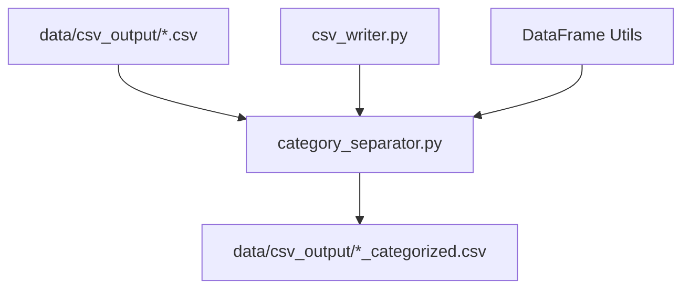

# Category Separation Plan

## Implementation Status:  COMPLETE

**Implementation Date:** 2026-01-15  
**Status:** Production-ready and integrated into CSV export pipeline  
**Feature Enabled:** By default (can be disabled via parameter)

---

## Overview

This document outlines the plan to extract **category headers** and separate them from **line items** in CSV tables. The goal is to transform flat table structures into a categorized format where each line item is associated with its parent category.

> [!NOTE]
> **Relationship to Metadata `Category (Parent)`**: The `Category (Parent)` field in the Index.csv metadata is the **same concept** as the in-table category headers. This plan extracts categories from the table data and updates the metadata accordingly for each table.

---

## Source and Destination Files

> [!NOTE]
> For detailed source and destination information, see [source_destination_plan.md](../source_destination/source_destination_plan.md#2-category-separation)

**Quick Summary:**
- **Input:** `./data/csv_output/[workbook_name]/[table_name].csv` (from Excel to CSV migration)
- **Output:** Same files transformed in-place with added `Category` column
- **Metadata Update:** Updates `Category_Parent` field in `Index.csv`

---

## Implementation Files

### Files Created

| File | Purpose |
|------|--------|
| `src/infrastructure/extraction/exporters/csv_exporter/category_separator.py` | Core CategorySeparator class |
| `tests/unit/test_category_separator.py` | Unit tests (pytest) |
| `test_category_separator_standalone.py` | Standalone tests (no dependencies) |
| `req_update/category_seperation/implementation_summary.md` | Implementation documentation |

### Files Modified

| File | Changes |
|------|--------|
| `src/infrastructure/extraction/exporters/csv_exporter/exporter.py` | Added CategorySeparator integration, `enable_category_separation` parameter |

### Integration Point

Category separation is applied in **`exporter.py`** during the `_process_sheet()` method, **before** writing CSV files:

```python
# In _process_sheet()
if self.category_separator:
    categorized_df, categories_found = self.category_separator.separate_categories(table.data_df)
    if not categorized_df.empty:
        df_to_write = categorized_df
        table.metadata['Category_Parent'] = ", ".join(categories_found)
```

---

## Assumptions

### Single-Row Header Format

CSV tables are assumed to have a **single-row header** (already pre-flattened). The header row starts with a unit descriptor and period columns follow the pattern:

```
[Unit Descriptor], [Period Headers...]
```

**Example Header Formats:**
- `$ in millions, Q3-QTD-2025, Q3-QTD-2024, Q3-YTD-2025, Q3-YTD-2024`
- `$ in millions, Q4-2025 Standardized, Q2-QTD-2023 Average Monthly Balance`
- ` in Billions, Q3-QTD-2025, Q3-QTD-2024, Q3-YTD-2025, Q3-YTD-2024`
- ` in billions, Q4-2025 Standardized, Q2-QTD-2023 Average Monthly Balance`

**Period Header Pattern:** `Qn-YYYY [Optional Text]` or `Qn-QTD-YYYY [Optional Text]` or `Qn-YTD-YYYY [Optional Text]`

### Footnotes Already Removed

Footnote rows are **not present** in the CSV output - they are already cleaned during earlier processing. Any remaining text rows (e.g., `Note:`, `(1)...`) are treated as regular line items or categories based on their position and data columns.

---

## Problem Statement

Current CSV output has tables where:
- **Category headers** appear as rows with text in the first column but **empty data columns**
- **Line items** follow their category with actual data values
- Categories are not explicitly linked to their child line items
- The `Category (Parent)` metadata field is not populated per-table

**Example Input:**

```csv
$ in millions, except per share data,Q3-QTD-2025,Q3-QTD-2024,Q3-YTD-2025,Q3-YTD-2024
,,,,
Consolidated results,,,,
Net revenues,18224,15383,52755,45538
Earnings applicable to Morgan Stanley common shareholders,4450,3028,11999,9236
Earnings per diluted common share,2.8,1.88,7.53,5.73
Consolidated financial measures,,,,
Expense efficiency ratio,0.67,0.72,0.69,0.72
ROE,0.18,0.131,0.165,0.135
Pre-tax margin by segment,,,,
Institutional Securities,0.37,0.28,0.34,0.3
Wealth Management,0.3,0.28,0.29,0.27
Investment Management,0.22,0.18,0.21,0.17
```

**Expected Output:**

| Category | Product/Entity (Line Items) | Q3-QTD-2025 | Q3-QTD-2024 | Q3-YTD-2025 | Q3-YTD-2024 |
|----------|----------------------------|-------------|-------------|-------------|-------------|
| Consolidated results | Net revenues | 18224 | 15383 | 52755 | 45538 |
| Consolidated results | Earnings applicable to Morgan Stanley common shareholders | 4450 | 3028 | 11999 | 9236 |
| Consolidated results | Earnings per diluted common share | 2.8 | 1.88 | 7.53 | 5.73 |
| Consolidated financial measures | Expense efficiency ratio | 0.67 | 0.72 | 0.69 | 0.72 |
| Consolidated financial measures | ROE | 0.18 | 0.131 | 0.165 | 0.135 |
| Pre-tax margin by segment | Institutional Securities | 0.37 | 0.28 | 0.34 | 0.3 |
| Pre-tax margin by segment | Wealth Management | 0.3 | 0.28 | 0.29 | 0.27 |
| Pre-tax margin by segment | Investment Management | 0.22 | 0.18 | 0.21 | 0.17 |

---

## Category Detection Logic

### Definition of a Category Header Row

A row is considered a **category header** if it meets ALL of the following criteria:

1. **Position**: Appears AFTER the header row (row 1)
2. **First column has text**: `row[0]` is not empty/blank
3. **All data columns are empty**: `row[1:]` are all empty, blank, or contain only whitespace

```python
def is_category_header(row: list, header_row: list) -> bool:
    """
    Determine if a row is a category header.
    
    Args:
        row: The row to check (list of cell values)
        header_row: The header row for reference
    
    Returns:
        True if this is a category header row
    """
    # First column must have text
    if not row[0] or str(row[0]).strip() == '':
        return False
    
    # All subsequent columns must be empty
    for cell in row[1:]:
        cell_value = str(cell).strip() if cell else ''
        if cell_value and cell_value not in ['', '-', '$-', '$ -']:
            return False
    
    return True
```

### Edge Cases for Category Detection

| Scenario | First Column | Data Columns | Is Category? |
|----------|--------------|--------------|--------------|
| Category row | "Consolidated results" | `,,,,` |  Yes |
| Data row | "Net revenues" | `18224,15383,...` |  No |
| Empty row | `` | `,,,,` |  No |
| Header row | "$ in millions" | `Q3-QTD-2025,...` |  No (is header) |
| Dash-only values | "Total" | `$-,-,-,-` |  No (has values) |

---

## Output Schema

### Modified CSV Structure

**New columns added:**

| Column Name | Description |
|-------------|-------------|
| `Category` | The parent category for this line item (empty if no category) |
| `Product/Entity` | The line item name (original first column value) |

**Column Order:**

```
Category | Product/Entity | Period Column 1 | Period Column 2 | ... | Period Column N
```

**Example Period Headers:** `Q3-QTD-2025`, `Q4-2025 Standardized`, `Q2-QTD-2023 Average Monthly Balance`

### Renamed Columns

- The original first column (containing line item names) becomes `Product/Entity`
- A new `Category` column is inserted at position 0

### Metadata Update

When categories are extracted, the `Category (Parent)` metadata field in Index.csv should be **updated** to reflect the categories found in each table:

```python
# Example: Update metadata after category extraction
metadata['Category_Parent'] = ", ".join(unique_categories_found)
# e.g., "Consolidated results, Consolidated financial measures, Pre-tax margin by segment"
```

---

## Processing Algorithm

```python
def separate_categories(df: pd.DataFrame) -> pd.DataFrame:
    """
    Process a DataFrame to extract categories and associate them with line items.
    
    Args:
        df: Input DataFrame with raw table data
        
    Returns:
        DataFrame with Category column added
    """
    result_rows = []
    current_category = ""
    
    # First row is the header
    header_row = df.iloc[0].tolist()
    
    for idx in range(1, len(df)):
        row = df.iloc[idx].tolist()
        
        # Skip empty rows
        if not row[0] or str(row[0]).strip() == '':
            continue
        
        if is_category_header(row, header_row):
            # This is a category header - update current category
            current_category = str(row[0]).strip()
        else:
            # This is a data row - add with category
            result_rows.append({
                'Category': current_category,
                'Product/Entity': str(row[0]).strip(),
                **{header_row[i]: row[i] for i in range(1, len(header_row))}
            })
    
    return pd.DataFrame(result_rows)
```

---

## Complex Category Patterns

### Pattern 1: Simple Categories

Most common pattern - single-level categories.

```
Header Row
Category A (empty data)
  - Line Item 1 (with data)
  - Line Item 2 (with data)
Category B (empty data)
  - Line Item 3 (with data)
```

### Pattern 2: No Categories Present

Some tables have **no category headers** at all - every non-header row is a line item with data.

**Example Input (no categories):**

```csv
$ in millions,Q3-QTD-2025,Q3-QTD-2024
Net revenues,18224,15383
Compensation expense,7442,6733
Non-compensation expense,3781,3459
```

**Expected Output:**

| Category | Product/Entity | Q3-QTD-2025 | Q3-QTD-2024 |
|----------|----------------|-------------|-------------|
| *(empty)* | Net revenues | 18224 | 15383 |
| *(empty)* | Compensation expense | 7442 | 6733 |
| *(empty)* | Non-compensation expense | 3781 | 3459 |

**Handling:** When no category headers are detected, the `Category` column will be empty for all rows. The schema remains consistent - the column exists but contains empty values.

```python
# In separate_categories(), current_category starts as ""
current_category = ""  # Remains empty if no categories detected
```

### Pattern 3: Nested Categories

Some tables have sub-categories.

```csv
Designated as accounting hedges,,,,
Interest rate,3,5,$ -,8
Foreign exchange,49,60,-,109
Total,52,65,-,117
Not designated as accounting hedges,,,,
Economic hedges of loans Credit,-,19,-,19
Other derivatives,,,,
Interest rate,114429,14447,110,128986
```

**Handling:** For Phase 1, treat all empty-data rows as categories at the same level. Parent-child relationships can be added in Phase 2.

### Pattern 3: Category as Repeated Header Text

Some tables have category names repeated across the row:

```csv
State and municipal securities,State and municipal securities,State and municipal securities,...
Beginning balance,10,,-,-,34
```

**Detection:** If all non-empty data columns contain the same text as the first column, treat as a category.

```python
def is_repeated_header_category(row: list) -> bool:
    """Check if non-empty values all match the first column."""
    first_col = str(row[0]).strip()
    for cell in row[1:]:
        cell_value = str(cell).strip() if cell else ''
        if cell_value and cell_value != first_col:
            return False
    return True
```

---

## Implementation Phases

### Phase 1: Core Category Extraction  COMPLETE

- [x] Create `category_separator.py` module
- [x] Implement `is_category_header()` function
- [x] Implement `separate_categories()` function
- [x] Add Category column to output CSV schema
- [x] Update CSV exporter to use new schema
- [x] Handle NaN/empty row edge cases
- [x] Handle repeated-header-text pattern

### Phase 2: Enhanced Detection (Future)

- [ ] Handle nested categories (parent-child hierarchy)
- [ ] Add category depth level column (optional)
- [ ] Add `Has_Categories` flag to Index.csv

### Phase 3: Integration  COMPLETE

- [x] Integrate with existing CSV export pipeline
- [x] Add unit tests for category detection
- [x] Test on real CSV files
- [x] Update metadata (`Category_Parent` field)
- [x] Add `enable_category_separation` toggle

---

## File Dependencies



---

## Proposed Changes

### New Files

#### [NEW] `src/infrastructure/extraction/exporters/csv_exporter/category_separator.py`

Core module for category extraction:

```python
class CategorySeparator:
    """Extracts categories from CSV tables and associates with line items."""
    
    def separate_categories(self, df: pd.DataFrame) -> pd.DataFrame:
        """Main processing function."""
        pass
    
    def is_category_header(self, row: list, header_row: list) -> bool:
        """Detect category header rows."""
        pass
    
    def is_repeated_header_category(self, row: list) -> bool:
        """Detect repeated-text category pattern."""
        pass
```

### Modified Files

#### [MODIFY] `src/infrastructure/extraction/exporters/csv_exporter/csv_writer.py`

- Import and use `CategorySeparator` class
- Add option to enable/disable category separation
- Update output schema to include Category column

---

## Verification Plan

### Automated Tests

```bash
# Run unit tests for category separator
python -m pytest tests/unit/test_category_separator.py -v
```

**Test Cases:**

1. Simple category extraction (like `2_table_1.csv` example)
2. **No categories present** - table has only data rows, no category headers → Category column should be empty for all rows
3. Multiple categories in sequence
4. Nested categories
5. Repeated-header-text pattern
6. Edge cases (empty rows, dash-only values)

### Manual Verification

1. Run category separator on sample file:
   ```bash
   python -c "
   from src.infrastructure.extraction.exporters.csv_exporter.category_separator import CategorySeparator
   import pandas as pd
   
   df = pd.read_csv('./data/csv_output/10q0925/2_table_1.csv')
   separator = CategorySeparator()
   result = separator.separate_categories(df)
   print(result.to_string())
   "
   ```

2. Compare output with expected format from this plan.

---

## Success Criteria

1. **Category Detection Accuracy**: All category headers correctly identified
2. **Line Item Association**: Every line item correctly associated with its parent category
3. **Schema Compliance**: Output CSV has `Category | Product/Entity | Period Headers...` format
4. **No Data Loss**: All data values preserved during transformation
5. **Edge Case Handling**: Empty rows, dash values, and repeated headers handled correctly

---

## Next Steps

1. Review and approve this plan
2. Create `category_separator.py` module
3. Implement core detection functions
4. Add unit tests
5. Integrate with CSV export pipeline
6. Validate on sample files

