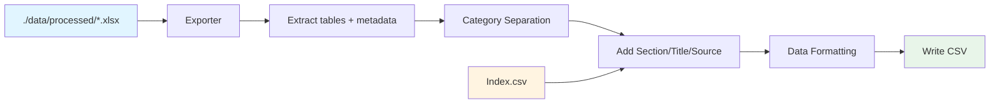

# Section and Table Title Column Addition Plan

## Implementation Status:  COMPLETE

**Completed Date:** 2026-01-15  
**Status:** Implemented and Verified  
**Feature:** Add Source, Section, and Table Title columns to CSV output

---

## Overview

This document outlines the plan to add three additional metadata columns to each exported CSV table:
- **Source** - The source PDF and page number (from Index.csv `Sources_Metadata`)
- **Section** - The section name from the Index sheet
- **Table Title** - The table title from the Index sheet

These columns will appear **before** the existing `Category` and `Product/Entity` columns.

---

## Source and Destination Files

> [!NOTE]
> For detailed source and destination information, see [source_destination_plan.md](../source_destination/source_destination_plan.md)

**Primary Input Sources:**

| Source | Location | Description |
|--------|----------|-------------|
| Excel Workbooks | `./data/processed/*.xlsx` | Contains Index sheet with metadata |
| Index CSV | `./data/csv_output/[workbook]/Index.csv` | Enhanced index with all metadata columns |

**Files Modified:**

| Location | Description |
|----------|-------------|
| `./data/csv_output/[workbook]/[table].csv` | Table CSV files - columns added |

---

## Current vs Target Schema

### Current CSV Structure

```csv
Category,Product/Entity,Q3-QTD-2025,Q3-QTD-2024,Q3-YTD-2025,Q3-YTD-2024
Consolidated results,Net revenues,$18,224,$15,383,$52,755,$45,538
Consolidated results,Earnings per diluted common share,$2.80,$1.88,$7.53,$5.73
```

**Current Column Order:**
```
Category | Product/Entity | <period headers>...
```

### Target CSV Structure

```csv
Source,Section,Table Title,Category,Product/Entity,Q3-QTD-2025,Q3-QTD-2024,Q3-YTD-2025,Q3-YTD-2024
10q0925.pdf_pg7,Business Segment Results,Selected Financial Information,Consolidated results,Net revenues,$18,224,$15,383,$52,755,$45,538
10q0925.pdf_pg7,Business Segment Results,Selected Financial Information,Consolidated results,Earnings per diluted common share,$2.80,$1.88,$7.53,$5.73
```

**Target Column Order:**
```
Source | Section | Table Title | Category | Product/Entity | <period headers>...
```

---

## Index.csv as Metadata Source

The Index.csv file contains all necessary metadata for each table. Current schema:

| Column | Source | Used For |
|--------|--------|----------|
| `Source` | Original Index | PDF filename |
| `PageNo` | Original Index | Page number |
| `Section` | Original Index | **→ Section column** |
| `Table Title` | Original Index | **→ Table Title column** |
| `Source` + `PageNo` | Original Index | **→ Source column** (constructed as `{Source}_pg{PageNo}`, e.g., `10q0925.pdf_pg7`) |
| `Table_Title_Metadata` | Metadata Block | Fallback Table Title |
| `CSV_File` | Generated | Links Index row to CSV file |

### Lookup Strategy

For each table being exported:

1. **Primary Lookup**: Use `CSV_File` column to find the matching row in Index.csv
2. **Extract Metadata**:
   - `Section` → From Index row (NOT from TableBlock - Section only exists in Index sheet)
   - `Table Title` → From Index row (prefer original, fallback to `Table_Title_Metadata`)
   - `Source` → Constructed from `Source` + `PageNo` columns as `{Source}_pg{PageNo}`

### Example Index Row

```csv
Source,PageNo,Table_ID,Location_ID,Section,Table Title,Link,Table_Index,...,Sources_Metadata,CSV_File
10q0925.pdf,7,2,7_1,Business Segment Results,Selected Financial Information,...,10q0925.pdf_pg7, 2025 Q3,2_table_1.csv
```

---

## Data Flow



**Processing Order:**
1. Extract tables from Excel sheet
2. Apply Category Separation (adds `Category`, `Product/Entity` columns)
3. **Add Section/Table Title/Source columns** (lookup from Index metadata)
4. Apply Data Formatting (formats currency, percentages)
5. Write to CSV

---

## Implementation Approach

### Option A: Inject Columns During Export (Recommended)

Add columns at export time in `exporter.py` after Category Separation and Data Formatting, using metadata from the `TableBlock` object.

**Advantages:**
- No additional file I/O
- Metadata already available from extraction
- Single-pass processing

**Implementation Location:** `exporter.py` → `_process_sheet()` method

### Option B: Post-Process Existing CSV Files

Read existing CSV files, lookup metadata from Index.csv, inject columns.

**Disadvantages:**
- Additional file read/write cycles
- Requires Index.csv to exist first
- More complex error handling

---

## Metadata Lookup Logic

### From TableBlock Metadata

The `TableBlock` dataclass already contains metadata extracted from each table:

```python
@dataclass
class TableBlock:
    metadata: Dict[str, Any]  # Contains 'Table Title', 'Source(s)', etc.
```

### From Index.csv (Fallback)

If metadata is not available in `TableBlock`, lookup from Index.csv using `CSV_File` column:

```python
def get_table_metadata(csv_filename: str, index_df: pd.DataFrame) -> dict:
    """
    Lookup table metadata from Index.csv.
    
    Args:
        csv_filename: Name of the CSV file (e.g., '2_table_1.csv')
        index_df: Loaded Index DataFrame
        
    Returns:
        Dictionary with 'Section', 'Table_Title', 'Source' keys
    """
    row = index_df[index_df['CSV_File'] == csv_filename]
    
    if row.empty:
        return {'Section': '', 'Table_Title': '', 'Source': ''}
    
    row = row.iloc[0]
    
    return {
        'Section': str(row.get('Section', '')).strip(),
        'Table_Title': str(row.get('Table Title', row.get('Table_Title_Metadata', ''))).strip(),
        'Source': str(row.get('Sources_Metadata', '')).strip()
    }
```

---

## Fallback Strategy with Warnings

> [!IMPORTANT]
> If metadata lookup fails for any field, use an empty string and log a warning. Do not fail the entire export.

### Fallback Hierarchy

| Field | Primary Source | Fallback 1 | Default |
|-------|---------------|------------|----------|
| **Source** | Index `Source` + `PageNo` (constructed as `{Source}_pg{PageNo}`) | N/A | `""` + warning |
| **Section** | Index `Section` (ONLY source - not in TableBlock) | N/A | `""` + warning |
| **Table Title** | Index `Table Title` | `Table_Title_Metadata` | `""` + warning |

### Warning Format

```python
logger.warning(
    f"Missing metadata for {csv_filename}: "
    f"Section={section!r}, Table_Title={table_title!r}, Source={source!r}"
)
```

---

## Implementation Details

### New Module: `metadata_injector.py`

```python
"""
Metadata Column Injector.

Adds Source, Section, and Table Title columns to table DataFrames.
"""

class MetadataInjector:
    """Injects metadata columns into table DataFrames."""
    
    def inject_metadata_columns(
        self,
        df: pd.DataFrame,
        section: str,
        table_title: str,
        source: str
    ) -> pd.DataFrame:
        """
        Add Source, Section, and Table Title columns to DataFrame.
        
        Args:
            df: Input DataFrame (already has Category, Product/Entity columns)
            section: Section name from Index
            table_title: Table title from Index
            source: Source reference (e.g., '10q0925.pdf_pg7, 2025 Q3')
            
        Returns:
            DataFrame with new columns prepended
        """
        # Get existing columns
        existing_cols = list(df.columns)
        
        # Add new columns with constant values
        df = df.copy()
        df.insert(0, 'Table Title', table_title)
        df.insert(0, 'Section', section)
        df.insert(0, 'Source', source)
        
        return df
```

### Integration in `exporter.py`

```python
# In _process_sheet() method, after data formatting:

# Get metadata for injection from Index metadata (passed from export_workbook)
# NOTE: Section is ONLY in Index sheet, NOT in TableBlock.metadata
section = index_metadata.get('Section', '')
table_title = index_metadata.get('Table Title', table.metadata.get('Table Title', ''))

# Construct Source from Index Source + PageNo columns
source_pdf = index_metadata.get('Source', '')
page_no = index_metadata.get('PageNo', '')
source = f"{source_pdf}_pg{page_no}" if source_pdf and page_no else ''

# Inject metadata columns
if self.metadata_injector:
    df_to_write = self.metadata_injector.inject_metadata_columns(
        df_to_write,
        section=section or '',
        table_title=table_title or '',
        source=source or ''
    )
    
    if not section or not table_title or not source:
        self.logger.warning(
            f"Incomplete metadata for sheet {sheet_name}: "
            f"section={section!r}, table_title={table_title!r}, source={source!r}"
        )
```

---

## Metadata Wiring: Index → TableBlock

Currently, `TableBlock` metadata is extracted from the **table sheet metadata block**, but **not from the Index sheet**.

### Required Enhancement: Wire Index Metadata to TableBlock

Modify `export_workbook()` in `exporter.py` to:

1. Read Index sheet first
2. Build a mapping of `sheet_name` → Index row metadata
3. Pass this metadata to `_process_sheet()` 
4. Merge Index metadata with TableBlock metadata

```python
def export_workbook(self, xlsx_path: Path, output_dir: Path) -> WorkbookExportResult:
    # ... existing code ...
    
    # Load Index sheet first
    index_df = None
    index_metadata = {}  # sheet_name -> {Section, Table Title, Sources_Metadata}
    
    if 'Index' in sheet_names:
        index_df = pd.read_excel(xlsx, sheet_name='Index')
        index_metadata = self._build_index_metadata_map(index_df)
    
    for sheet_name in sheet_names:
        # Pass index_metadata to _process_sheet
        sheet_result = self._process_sheet(
            xlsx=xlsx,
            sheet_name=sheet_name,
            output_dir=output_dir,
            index_metadata=index_metadata.get(sheet_name, {})  # NEW
        )

def _build_index_metadata_map(self, index_df: pd.DataFrame) -> Dict[str, dict]:
    """Build mapping from sheet_name (Link column) to Index metadata."""
    metadata_map = {}
    
    for _, row in index_df.iterrows():
        link = str(row.get('Link', '')).strip()
        # Extract sheet number from link (e.g., '→ 2' -> '2')
        sheet_match = re.search(r'→\s*(\d+)', link)
        if sheet_match:
            sheet_name = sheet_match.group(1)
            metadata_map[sheet_name] = {
                'Section': str(row.get('Section', '')).strip(),
                'Table Title': str(row.get('Table Title', '')).strip(),
                'Source': str(row.get('Source', '')).strip(),
                'PageNo': str(row.get('PageNo', '')).strip(),
                # Note: Source column in output will be constructed as f"{Source}_pg{PageNo}"
            }
    
    return metadata_map
```

---

## Proposed Changes

### New Files

#### [NEW] `src/infrastructure/extraction/exporters/csv_exporter/metadata_injector.py`

Core module for injecting metadata columns:

```python
"""
Metadata Column Injector.

Injects Source, Section, and Table Title columns into table DataFrames.
"""

from typing import Optional
import pandas as pd
from src.utils import get_logger

logger = get_logger(__name__)


class MetadataInjector:
    """Injects metadata columns into table DataFrames."""
    
    def __init__(self):
        self.logger = get_logger(f"{__name__}.{self.__class__.__name__}")
    
    def inject_metadata_columns(
        self,
        df: pd.DataFrame,
        source: str = "",
        section: str = "",
        table_title: str = ""
    ) -> pd.DataFrame:
        """
        Add Source, Section, and Table Title columns to DataFrame.
        
        Columns are inserted at the beginning in order:
        Source | Section | Table Title | [existing columns]
        
        Args:
            df: Input DataFrame
            source: Source reference (e.g., '10q0925.pdf_pg7, 2025 Q3')
            section: Section name from Index
            table_title: Table title from Index
            
        Returns:
            DataFrame with metadata columns prepended
        """
        if df.empty:
            return df
        
        result_df = df.copy()
        
        # Insert columns in reverse order to get correct final order
        result_df.insert(0, 'Table Title', table_title)
        result_df.insert(0, 'Section', section)
        result_df.insert(0, 'Source', source)
        
        return result_df


def get_metadata_injector() -> MetadataInjector:
    """Factory function for MetadataInjector."""
    return MetadataInjector()
```

### Modified Files

#### [MODIFY] `src/infrastructure/extraction/exporters/csv_exporter/exporter.py`

1. Import `MetadataInjector`
2. Add `enable_metadata_injection` parameter to `__init__`
3. Add `_build_index_metadata_map()` method
4. Update `export_workbook()` to build Index metadata map
5. Update `_process_sheet()` to inject metadata columns

---

## Handling Multi-Table Sheets

For sheets with multiple tables (e.g., `2_table_1.csv`, `2_table_2.csv`):

1. Index.csv has **one row per table** (verified from current Index structure)
2. Each table gets its own `Table_Index` (1, 2, 3...)
3. All tables from the same sheet share the same `Section` 
4. Each table may have its own `Table Title` and `Sources_Metadata`

### Matching Logic

```python
def get_metadata_for_table(
    csv_filename: str,
    index_metadata_map: Dict[str, List[dict]]
) -> dict:
    """
    Get metadata for specific table CSV file.
    
    Args:
        csv_filename: e.g., '2_table_1.csv' or '5.csv'
        index_metadata_map: Map from sheet_name to list of table metadata
    
    Returns:
        Metadata dict for the specific table
    """
    # Parse filename
    if '_table_' in csv_filename:
        # Multi-table: '2_table_1.csv' -> sheet='2', table_index=1
        parts = csv_filename.replace('.csv', '').split('_table_')
        sheet_name = parts[0]
        table_index = int(parts[1])
    else:
        # Single-table: '5.csv' -> sheet='5', table_index=1
        sheet_name = csv_filename.replace('.csv', '')
        table_index = 1
    
    tables = index_metadata_map.get(sheet_name, [])
    
    for table_meta in tables:
        if table_meta.get('Table_Index') == table_index:
            return table_meta
    
    # Fallback: return first table's metadata or empty
    return tables[0] if tables else {}
```

---

## Verification Plan

### Automated Tests

```bash
# Run unit tests for metadata injector
python -m pytest tests/unit/test_metadata_injector.py -v
```

**Test Cases:**

1. Basic injection with all three fields populated
2. Partial metadata (some fields empty)
3. Empty DataFrame handling
4. Multi-table sheets (correct metadata per table)
5. Missing Index row (fallback to warnings)

### Manual Verification

1. Re-run CSV export:
   ```bash
   python -c "
   from src.infrastructure.extraction.exporters.csv_exporter import get_csv_exporter
   exporter = get_csv_exporter()
   result = exporter.export_workbook(
       Path('./data/processed/10q0925_tables.xlsx'),
       Path('./data/csv_output/10q0925_test')
   )
   print(f'Exported: {result.csv_files_created} files')
   "
   ```

2. Verify CSV structure:
   ```bash
   head -3 ./data/csv_output/10q0925_test/2_table_1.csv
   # Expected: Source,Section,Table Title,Category,Product/Entity,Q3-QTD-2025,...
   ```

3. Verify metadata populated:
   ```bash
   cut -d',' -f1,2,3 ./data/csv_output/10q0925_test/2_table_1.csv | head -5
   ```

---

## Error Handling

### Scenario 1: Index Row Not Found

- **Behavior**: Log warning, use empty strings for all metadata columns
- **Export continues**: Yes

### Scenario 2: Partial Metadata

- **Behavior**: Log warning with specific missing fields, use empty strings for missing
- **Export continues**: Yes

### Scenario 3: Index.csv Does Not Exist

- **Behavior**: Log warning, all tables get empty metadata columns
- **Export continues**: Yes

---

## Implementation Phases

### Phase 1: Core Implementation  COMPLETE

- [x] Create `metadata_injector.py` module
- [x] Add unit tests for `MetadataInjector`
- [x] Integrate into `exporter.py`
- [x] Add `enable_metadata_injection` parameter

### Phase 2: Index Metadata Wiring  COMPLETE

- [x] Add `_build_index_metadata_map()` method to exporter
- [x] Wire Index metadata to `_process_sheet()`
- [x] Handle multi-table sheets

### Phase 3: Testing and Validation  COMPLETE

- [x] Run on all workbooks
- [x] Verify column order matches spec
- [x] Verify warning messages for missing metadata
- [x] Update documentation

---

## Success Criteria

1. **Column Order**: Output CSV has columns in order: `Source | Section | Table Title | Category | Product/Entity | <period headers>`
2. **Metadata Populated**: All three new columns contain correct values from Index
3. **Fallback Works**: Missing metadata results in empty strings + logged warnings
4. **No Data Loss**: All existing data preserved
5. **Consistent Schema**: All CSV files have the same column schema

---

## Dependencies

- Requires Category Separation (Step 2) to complete first
- This step (Metadata Injection) is Step 3, followed by Data Formatting (Step 4)
- Uses existing Index.csv as metadata source

---

## Configuration Options

```python
exporter = get_csv_exporter(
    enable_category_separation=True,    # Add Category column
    enable_data_formatting=True,         # Format currency/percentage
    enable_metadata_injection=True       # NEW: Add Source/Section/Table Title
)
```

---

## Next Steps

1.  Review and approve this plan
2.  Create `metadata_injector.py` module
3.  Add unit tests
4.  Integrate with exporter
5.  Test on sample files
6.  Run full export and validate
