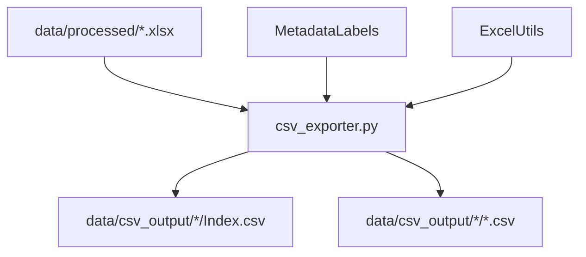

# Excel to CSV Migration Plan

## Overview

This document outlines the plan to migrate Excel workbooks (`./data/processed/*.xlsx`) to CSV format with enhanced metadata management in a consolidated Index CSV.

---

> [!NOTE]
> For consolidated source and destination information across all pipeline steps, see [source_destination_plan.md](../source_destination/source_destination_plan.md#1-excel-to-csv-migration)

## Current Data Structure Analysis

### Source Files
| File | Size | Sheets |
|------|------|--------|
| `10k1224_tables.xlsx` | ~433 KB | ~162 sheets |
| `10q0325_tables.xlsx` | ~312 KB | ~160 sheets |
| `10q0624_tables.xlsx` | ~331 KB | ~160 sheets |
| `10q0925_tables.xlsx` | ~327 KB | ~160 sheets |

### Current Sheet Types

1. **Index Sheet** - Quick reference
   - Columns: `Source`, `PageNo`, `Table_ID`, `Location_ID`, `Section`, `Table Title`, `Link`

2. **Table Sheets** (numbered: 1, 2, 3, ...)
   - Each contains one or more tables with metadata blocks

### Metadata Structure Per Table

Each table in a sheet has the following metadata keys (in order of appearance):

| Key | Description | Mandatory |
|-----|-------------|-----------|
| `Category (Parent)` | Parent category of line items | No |
| `Line Items` | Comma-separated list of row labels | No |
| `Product/Entity` | Product or entity names | No |
| `Column Header` | Column headers (e.g., `Q1-2025, Q2-QTD-2025, Q2-YTD-2025, YTD-2025`) | No |
| `Table Title` | Title of the table | **Yes** |
| `Source(s)` | Source file and page reference | **Yes** |

> [!IMPORTANT]
> **Table Title** and **Source(s)** are mandatory fields and must always be populated.

### Multi-Table Sheets

Some sheets contain multiple tables, each with its own metadata block:

| Sheet | Number of Tables |
|-------|------------------|
| 8, 14 | 4 tables |
| 2, 3, 6, 9, 10, 11, 16, 21, ... | 2 tables |

**Example Structure (Sheet with 2 tables):**

> [!NOTE]
> - Each sheet **always** has one full metadata block at the start (rows 1-11)
> - First table data starts at **row 13** (after metadata + blank row)
> - Subsequent tables (2nd, 3rd, etc.) can have **either**:
>   - **Minimal metadata**: Only Table Title and Source(s)
>   - **Full metadata**: Complete metadata block (same as first table)

**Case 1: Subsequent table with minimal metadata**
```
Row 0:  ← Back to Index
Row 1:  Category (Parent): 
Row 2:  Line Items: $ in millions, Net revenues, ...
Row 3:  Product/Entity: ...
Row 4:  Column Header: Q3-QTD-2025, Q3-QTD-2024, Q3-YTD-2025, Q3-YTD-2024
Row 5:  Table Title: Selected Non-GAAP Financial Information
Row 6:  Source(s): 10q0925.pdf_pg8, 2025 Q3
...
Row 11: [blank]
Row 12: [blank]
Row 13: [Table 1 data starts - header row like "$ in millions"]
...
Row 28: [blank - separator]
Row 29: Table Title: Tangible Common Equity Summary    <-- Only Title & Source
Row 30: Source(s): 10q0925.pdf_pg8, 2025 Q3
Row 31: [blank]
Row 32: [Table 2 data starts]
```

**Case 2: Subsequent table with full metadata**
```
...
Row 28: [blank - separator]
Row 29: Category (Parent): Tangible equity
Row 30: Line Items: Common equity, Preferred stock, ...
Row 31: Product/Entity: ...
Row 32: Column Header: Q3-QTD-2025, Q3-QTD-2024
Row 33: Table Title: Tangible Common Equity Summary
Row 34: Source(s): 10q0925.pdf_pg8, 2025 Q3
Row 35: [blank]
Row 36: [Table 2 data starts]
```

---

## Target CSV Structure

### Output Directory Structure
```
./data/csv_output/
 10q0925/
    Index.csv           # Enhanced Index with all metadata columns
    1.csv               # Table sheet 1
    2.csv               # Table sheet 2
    2_table_1.csv       # For multi-table sheets (optional)
    2_table_2.csv       # For multi-table sheets (optional)
    ...
 10q0624/
    ...
 10q0325/
    ...
 10k1224/
     ...
```

### Enhanced Index CSV Schema

The new Index CSV will contain **all original Index columns** plus **metadata columns from all tables**:

| Column Name | Source | Description |
|-------------|--------|-------------|
| `Source` | Original Index | Source PDF filename |
| `PageNo` | Original Index | Page number |
| `Table_ID` | Original Index | Table identifier |
| `Location_ID` | Original Index | Location identifier |
| `Section` | Original Index | Section name |
| `Table Title` | Original Index | Table title from Index |
| `Link` | Original Index | Link to sheet |
| `Table_Index` | **NEW** | Index of table within sheet (1, 2, 3...) |
| `Category_Parent` | **NEW** | From metadata |
| `Line_Items` | **NEW** | From metadata |
| `Product_Entity` | **NEW** | From metadata |
| `Column_Header` | **NEW** | From metadata (e.g., `Q1-2025 ROE, Q2-QTD-2025 Average RAT`) |
| `Table_Title_Metadata` | **NEW** | Table title from metadata block |
| `Sources_Metadata` | **NEW** | Source(s) from metadata block |
| `CSV_File` | **NEW** | Path to exported CSV file |

> [!NOTE]
> Column names use underscores instead of spaces/parentheses for CSV compatibility.

### Table CSV Schema

Each table CSV will contain **only the data rows** (metadata extracted to Index):

| Row | Content |
|-----|---------|
| 1 | Column headers (e.g., `$ in millions`, `Q3-QTD-2025`, `Q3-QTD-2024`, ...) |
| 2+ | Data rows |

**Example:**
```csv
$ in millions,Q3-QTD-2025,Q3-QTD-2024,Q3-YTD-2025,Q3-YTD-2024
Net revenues,18224,15383,52755,45538
Adjustment for mark-to-market losses (gains) on DCP,-248,-239,-476,-372
Adjusted Net revenues-non-GAAP,17976,15144,52279,45166
```

---

## Migration Logic

### Step 1: Parse Excel Workbook

```python
def parse_workbook(xlsx_path):
    """
    Parse Excel workbook and extract:
    - Index sheet data
    - Table sheets with metadata
    """
```

### Step 2: Extract Metadata from Table Sheets

```python
METADATA_KEYS = [
    'Category (Parent)',
    'Line Items',
    'Product/Entity',
    'Column Header',
    'Table Title',
    'Source(s)'
]

def extract_table_metadata(sheet_df):
    """
    Parse a table sheet and extract:
    - List of metadata blocks (one per table)
    - Table data rows for each table
    
    Returns:
        List[Dict] with keys:
            - metadata: Dict of key-value pairs
            - data_rows: DataFrame of table data
            - start_row: Starting row of table data
            - end_row: Ending row of table data
    """
```

### Step 3: Build Enhanced Index

```python
def build_enhanced_index(original_index_df, table_metadata_map):
    """
    Merge original Index with metadata from all tables.
    
    For sheets with multiple tables:
    - Create one row per table
    - Each row has its own metadata
    
    For sheets with missing metadata keys:
    - Leave column blank (empty string)
    """

    ### Step 3a: Match Logic Verification (Crucial)
    
    The matching logic follows a "Greedy Best Match" strategy to handle:
    1. **Identical Titles (Sub-tables)**: If multiple Index rows have the same Title/Section (e.g., 4 rows of "ABC | Hello"), and multiple extracted tables share that title, they are matched **sequentially** (1st Row -> 1st Table, 2nd Row -> 2nd Table).
    2. **Distinct Titles**: Prioritizes matching by Title string.
    3. **Fallbacks**: If no title match, falls back to Order. Matches are removed from the pool to prevent duplicates.
    
    This ensures that 1_1, 1_2 (sub-tables) correctly map toTable 1, Table 2 even if they share the same metadata title.
```

### Step 4: Export to CSV

```python
def export_to_csv(workbook_data, output_dir):
    """
    Export:
    1. Enhanced Index CSV
    2. Individual table CSVs (data only, no metadata)
    """
```

---

## Handling Edge Cases

### 1. Missing Metadata Keys

**Problem:** Some sheets may not have all metadata keys.

**Solution:**
- Initialize all metadata columns with empty string
- Only populate columns where metadata exists
- Never throw error for missing optional metadata

```python
# Example: Sheet without "Category (Parent)"
metadata = {
    'Category_Parent': '',  # Empty - not present in sheet
    'Line_Items': 'Net revenues, ...',
    'Table_Title_Metadata': 'Financial Summary',  # Mandatory - always present
    'Sources_Metadata': '10q0925.pdf_pg7'  # Mandatory - always present
}
```

### 2. Multi-Table Sheets

**Problem:** Sheets with 2+ tables need separate Index entries.

**Solution:**
- Detect table boundaries using `Table Title:` marker
- Create separate Index row for each table
- Add `Table_Index` column to distinguish tables

```python
# Example Index entries for Sheet 3 with 2 tables:
[
    {
        'Table_ID': '3',
        'Table_Index': 1,
        'Table_Title_Metadata': 'Selected Non-GAAP Financial Information',
        'Category_Parent': '',
        'CSV_File': '3_table_1.csv'
    },
    {
        'Table_ID': '3',
        'Table_Index': 2,
        'Table_Title_Metadata': 'Selected Non-GAAP Financial Information',
        'Category_Parent': 'Tangible equity',
        'CSV_File': '3_table_2.csv'
    }
]
```

### 3. Mandatory Field Validation

**Problem:** Some tables might be missing mandatory fields.

**Solution:**
- Validate that `Table Title` and `Source(s)` exist for every table
- Log warning if mandatory field is missing
- Use fallback values:
  - `Table Title`: Use section name or "[Unknown Table]"
  - `Source(s)`: Use source PDF filename + "[Unknown Page]"

### 4. Metadata Value Parsing

**Problem:** Metadata values may contain commas, quotes, or newlines.

**Solution:**
- Use proper CSV escaping (quote values with commas)
- Replace newlines with semicolons or escape sequences
- Handle empty values gracefully

### 5. Manual Split Links and Filename Collisions

**Problem:** Some tables have links manually split (e.g., `18-1`) which collide with base tables (e.g., `18`) when sanitizing filenames, causing data loss.

**Solution:**
- Detect split IDs containing hyphens (e.g., `18-1`)
- Normalize filenames to preserve uniqueness:
  - `18` -> `18_table1.csv`
  - `18-1` -> `18_1_table1.csv` (Replace hyphen with underscore)
- Ensure unique filename generation for all tables

```python
# Example Filename Generation
def generate_filename(sheet_id, table_index):
    # Normalize sheet_id: "18-1" -> "18_1"
    safe_id = sheet_id.replace('-', '_')
    if table_index == 1:
        return f"{safe_id}_table1.csv"
    return f"{safe_id}_table{table_index}.csv"
```

---

## Implementation Tasks

### Phase 1: Core Infrastructure

- [x] Create `csv_exporter.py` module
- [x] Implement metadata extraction from table sheets
- [x] Implement enhanced Index builder
- [x] Implement CSV export functions

### Phase 2: Integration

- [x] Add CSV export option to main pipeline
- [x] Create command-line interface for migration
- [x] Handle all 4 source files

### Phase 3: Validation

- [x] Verify all metadata columns populated correctly
- [x] Validate mandatory fields present
- [x] Test multi-table sheet handling
- [x] Compare row counts (Index rows = sum of all tables)

---

## File Dependencies



---

## Success Criteria

1. **Completeness**: All tables from all sheets exported to CSV
2. **Metadata Preservation**: All 9 metadata keys captured in Index
3. **Multi-Table Handling**: Each table has separate Index entry
4. **Data Integrity**: No data loss during migration
5. **Mandatory Fields**: `Table Title` and `Source(s)` always populated

---

## Next Steps

1. Review and approve this plan
2. Create `csv_exporter.py` with core parsing logic
3. Implement metadata extraction algorithm
4. Build enhanced Index structure
5. Export and validate output
