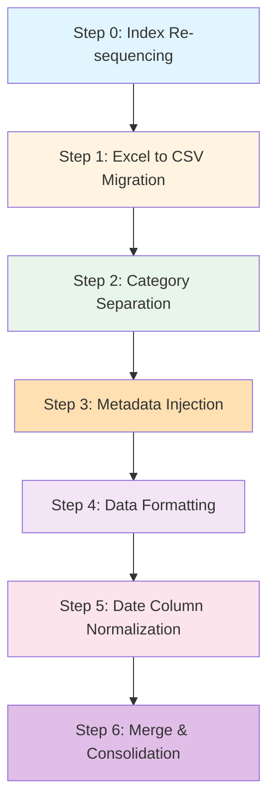

# Code Files Documentation

This document consolidates all code files involved in the  data processing pipeline.

---

## Recent Updates (2026-01-16)

**Issues Resolved from [issues_resolution_plan.md](../issues_list/issues_resolution_plan.md):**

| Issue ID | Description | Status | Impact |
|----------|-------------|--------|--------|
| 0.1 | Sheet Name Conflicts |  Fixed | Eliminated ~160 rename conflicts through two-pass safe renaming |
| 0.2 | Block Detection Mismatch |  Tracked | Added statistics tracking for block vs Index discrepancies |
| 0.3 | Index Entry Count Discrepancy |  Resolved | Comprehensive statistics reporting with auto-generated reports |
| 1.1 | Incomplete Metadata Warnings |  Fixed | Intelligent fallback strategies reduce missing metadata warnings |
| 2.1 | Empty Tables After Category Separation |  Fixed | Smart detection and categorization of empty tables |

**Files Modified:**
- `src/index_sheet_resequencer.py` (+180 lines) - Safe renaming, stats tracking
- `src/infrastructure/extraction/exporters/csv_exporter/metadata_injector.py` (+137 lines) - Fallback strategies
- `src/infrastructure/extraction/exporters/csv_exporter/category_separator.py` (+136 lines) - Empty table handling

---

## Table of Contents

1. [Index Sheet Re-sequencing](#1-index-sheet-re-sequencing)
2. [Excel to CSV Migration](#2-excel-to-csv-migration)
3. [Category Separation](#3-category-separation)
4. [Metadata Column Injection](#4-metadata-column-injection)
5. [Data Formatting](#5-data-formatting)
6. [Normalized Export (Step 5)](#6-normalized-export-step-5)
7. [Merge & Consolidation (Step 6)](#7-merge--consolidation-step-6)
8. [All Files Reference](#all-files-reference)

---

## 1. Index Sheet Re-sequencing

> **Plan Document:** [index_sheet_mapping/index_sheet_mapping_table.md](../index_sheet_mapping/index_sheet_mapping_table.md)

### Implementation Files

| File | Purpose | Status |
|------|---------|--------|
| `src/index_sheet_resequencer.py` | Core re-sequencing implementation (~785 lines) |  Complete + **Enhanced** |
| `scripts/test_index_resequencer.py` | Test & analysis tool |  Complete |

### Recent Enhancements

**Issue 0.1 - Sheet Name Conflicts (FIXED)**
- Added `_rename_sheets_safe()` method with two-pass renaming strategy
- Added `_get_unique_sheet_name()` to handle conflicts with counter appending
- Uses temporary UUIDs to avoid intermediate conflicts
- **Status:**  Resolved

**Issue 0.2 - Block Detection Mismatch (TRACKED)**
- Added `_split_sheets()` statistics tracking for block vs Index mismatches
- Logs detailed warnings with block count vs Index entry count
- Tracks mismatches in statistics report
- **Status:**  Detection implemented (auto-reconciliation can be added later)

**Issue 0.3 - Index Entry Count Discrepancy (RESOLVED)**
- Added `ResequencerStats` class to track comprehensive statistics
- Generates detailed statistics report with analysis
- Reports: total sheets, blocks detected, multi-table sheets, rename conflicts, mismatches
- Auto-saves stats report as `*_stats.md` alongside output file
- **Status:**  Resolved

### Documentation Files

| File | Purpose |
|------|---------|
| `implementation_summary.md` | Technical documentation |
| `quick_start.md` | Quick reference guide |
| `README.md` | Folder overview |

### Key Functionality

- Re-sequences xlsx Index sheets based on unique (Section + Table Title)
- Physically splits multi-table sheets into separate sheets
- Updates Link and Table_ID columns
- Maintains hyperlinks for navigation
- Conflict-free sheet renaming with automatic resolution
- Comprehensive statistics tracking and reporting
- Block vs Index reconciliation tracking

---

## 2. Excel to CSV Migration

> **Plan Document:** [excel_to_csv_migration_plan.md](../excel_to_csv_migration/excel_to_csv_migration_plan.md)

### Implementation Files

| File | Purpose | Status |
|------|---------|--------|
| `src/infrastructure/extraction/exporters/csv_exporter/exporter.py` | Main CSV export logic |  Complete |
| `src/infrastructure/extraction/exporters/csv_exporter/__init__.py` | Module exports |  Complete |

### Key Functionality

- Parses Excel workbooks from `./data/processed/*.xlsx`
- Extracts metadata blocks from table sheets
- Builds enhanced Index CSV with all metadata columns
- Exports individual table CSVs (data only)
- Handles multi-table sheets with `[sheet_id]_table_[n].csv` naming

---

## 3. Category Separation

> **Plan Document:** [category_separation_plan.md](../column_data_populated/category_separation_plan.md)

### Implementation Files

| File | Purpose | Status |
|------|---------|--------|
| `src/infrastructure/extraction/exporters/csv_exporter/category_separator.py` | Core CategorySeparator class (~305 lines) |  Complete + **Enhanced** |

### Recent Enhancements

**Issue 2.1 - Empty Tables After Category Separation (FIXED)**
- Added `EmptyTableAnalyzer` class to categorize why tables become empty
- Added `separate_categories()` enhanced with empty table detection
- Returns `None` for metadata-only or truly empty tables (to skip export)
- Returns empty DataFrame for review when data unexpectedly filtered
- Tracks all empty tables with detailed analysis
- Generates `generate_empty_tables_report()` with categorized findings
- **Status:**  Resolved

### Test Files

| File | Purpose |
|------|---------|
| `tests/unit/test_category_separator.py` | Unit tests (pytest) |
| `test_category_separator_standalone.py` | Standalone tests (no dependencies) |

### Modified Files

| File | Changes |
|------|---------|
| `src/infrastructure/extraction/exporters/csv_exporter/exporter.py` | Added `enable_category_separation` parameter, CategorySeparator integration |

### Key Functionality

- Detects category header rows (text in first column, empty data columns)
- Adds `Category` and `Product/Entity` columns to CSV output
- Handles edge cases: no categories, repeated-header-text pattern
- Updates `Category_Parent` metadata field in Index.csv
- Empty table detection with 4 categories: empty_input, metadata_only, all_headers, filtered_out
- Smart filtering - skips truly empty tables, exports suspicious ones for review
- Comprehensive empty tables report generation

### Integration Point

```python
# In exporter.py → _process_sheet()
if self.category_separator:
    categorized_df, categories_found = self.category_separator.separate_categories(table.data_df, sheet_name)
    if categorized_df is None:
        # Skip export for this table
        continue
    table.metadata['Category_Parent'] = ", ".join(categories_found)
```

---

## 4. Metadata Column Injection

> **Plan Document:** [section_tabletitle_plan.md](../column_data_populated/section_tabletitle_plan.md)

### Implementation Files

| File | Purpose | Status |
|------|---------|--------|
| `src/infrastructure/extraction/exporters/csv_exporter/metadata_injector.py` | MetadataInjector class (~196 lines) |  Complete + **Enhanced** |

### Recent Enhancements

**Issue 1.1 - Incomplete Metadata Warnings (FIXED)**
- Added `MetadataFallbackStrategy` class with 3 fallback strategies:
  1. Extract from sheet name patterns (e.g., "51_Business_Segment")
  2. Extract from DataFrame content heuristically (title detection)
  3. Generate placeholder with [MISSING] or [AUTO] tags
- Enhanced `inject_metadata_columns()` to use fallback strategies when metadata is incomplete
- Tracks statistics: `metadata_missing_count` and `fallback_used_count`
- Generates `generate_metadata_quality_report()` with warnings and recommendations
- **Status:**  Resolved

### Modified Files

| File | Changes |
|------|---------|
| `src/infrastructure/extraction/exporters/csv_exporter/exporter.py` | Added `enable_metadata_injection` parameter, `_build_index_metadata_map()` method |

### Key Functionality

- Injects `Source`, `Section`, and `Table Title` columns to CSV output
- Columns prepended in order: `Source | Section | Table Title | Category | Product/Entity | <periods>`
- Reads metadata from Index.csv using `CSV_File` column lookup
- Fallback to empty strings with warnings for missing metadata
- Intelligent fallback strategies with priority levels
- Automatic placeholder generation with clear [MISSING]/[AUTO] tags
- Metadata quality reporting with actionable recommendations

### Integration Point

```python
# In exporter.py → _process_sheet()
if self.metadata_injector:
    df_to_write = self.metadata_injector.inject_metadata_columns(
        df_to_write,
        source=f"{source_pdf}_pg{page_no}",
        section=section,
        table_title=table_title,
        sheet_name=sheet.title,  # NEW: for fallback
        table_index=table_index  # NEW: for fallback
    )
```

---

## 5. Data Formatting

> **Plan Document:** [data_formatting_plan.md](../data_format/data_formatting_plan.md)

### Implementation Files

| File | Purpose | Status |
|------|---------|--------|
| `src/infrastructure/extraction/exporters/csv_exporter/data_formatter.py` | DataFormatter class with format functions |  Complete |

### Test Files

| File | Purpose |
|------|---------|
| `tests/unit/test_data_formatter.py` | Unit tests |

### Modified Files

| File | Changes |
|------|---------|
| `src/infrastructure/extraction/exporters/csv_exporter/exporter.py` | Added `enable_data_formatting` parameter, DataFormatter integration |

### Key Functionality

- Applies currency formatting: `$18,224` (with $ and thousand separators)
- Applies percentage formatting: `17.4%`
- Normalizes negative values: `($1,234)` parenthetical notation
- Row-based detection for ratios (ROE, margin → percentage format)
- Column-based detection for `% change` columns
- Preserves special values: `N/M`, `N/A`, `-`

### Configuration

```python
@dataclass
class DataFormatConfig:
    add_currency_symbol: bool = True
    add_thousand_separators: bool = True
    negative_style: str = 'parenthetical'  # or 'minus'
    percentage_decimal_places: int = 1
    convert_decimal_to_percentage: bool = True
```

---

## 6. Normalized Export (Step 5)

> **Plan Document:** [date_column_value_separation_plan.md](../column_data_populated/date_column_value_separation_plan.md)  
> **Implementation Summary:** [date_column_value_separation_implementation.md](../column_data_populated/date_column_value_separation_implementation.md)

### Implementation Files

| File | Purpose | Status |
|------|---------|--------|
| `src/infrastructure/extraction/exporters/csv_exporter/data_normalizer.py` | DataNormalizer class for wide→long transformation (~260 lines) |  Complete |

### Test Files

| File | Purpose |
|------|---------|
| `tests/test_data_normalizer.py` | Comprehensive test suite (7 tests) |

### Scripts

| File | Purpose |
|------|---------|
| `scripts/normalize_csv_data.py` | CLI tool for in-place CSV normalization |
| `scripts/export_with_normalization.py` | Re-export with normalization enabled |

### Modified Files

| File | Changes |
|------|---------|
| `src/infrastructure/extraction/exporters/csv_exporter/exporter.py` | Added `enable_data_normalization` parameter, DataNormalizer integration |

### Key Functionality

- Transforms wide format (period columns) to long format (Dates, Header, Data Value)
- Parses column headers: `Q3-2025 IS` → Dates=`Q3-2025`, Header=`IS`
- Excludes unit indicator columns (e.g., `$ in millions`)
- Handles period patterns: `Q1-2025`, `Q3-QTD-2025`, `YTD-2024`, etc.
- Row multiplication: original rows × number of period columns
- Built-in validation for transformation correctness

### Integration Point

```python
# In exporter.py → _process_sheet()
if self.data_normalizer:
    df_to_write = self.data_normalizer.normalize_table(df_to_write)
```

### Transformation Example

```
BEFORE: Source,Section,...,Q3-2025,Q3-2025 IS
        ...,...,...,$18,224,$5,000

AFTER:  Source,Section,...,Dates,Header,Data Value
        ...,...,...,Q3-2025,,$18,224
        ...,...,...,Q3-2025,IS,$5,000
```

---

## 7. Merge & Consolidation (Step 6)

> **Plan Document:** [merge_across_csv_in_folder_plan.md](../merge_across_csv_in_folder/merge_across_csv_in_folder_plan.md)

### 6. Merge Pipelines

| File | Purpose | Status |
|------|---------|--------|
| `src/pipeline/merge_csv_pipeline.py` | Consolidates normalized CSV files into master datasets. |  Active |

### 7. Table View Generation

| File | Purpose | Status |
|------|---------|--------|
| `src/table_view/master_table_index_generator.py` | Generates `Master_Table_Index.csv` cataloging all unique tables. |  Active |
| `src/table_view/table_view_generator.py` | Generates individual Time-Series View CSVs (`[Table_ID].csv`). |  Active |
| `src/table_view/run_table_view.py` | Orchestrator script for the table view generation module. |  Active |

## Tests & Scripts

### Key Functionality

- **Individual Merge:** Consolidates all table CSVs within a source folder into `[Source]_consolidated.csv`.
- **Master Merge:** Combines individual consolidated files into `Master_Consolidated.csv`.
- **Edge Case Handling:** 
  - Handles BOM (`utf-8-sig`)
  - Skips empty/header-only files
  - Excludes `Index.csv`
- **Output:** Normalized CSVs with schema `| Source | Section | Table Title | Category | Product/Entity | Dates | Header | Data Value |`.

---

## Pipeline Integration

All components are integrated through `exporter.py` with toggle parameters:

```python
from src.infrastructure.extraction.exporters.csv_exporter import get_csv_exporter

exporter = get_csv_exporter(
    enable_category_separation=True,    # Step 3: Add Category column
    enable_metadata_injection=True,     # Step 4: Add Source/Section/Table Title
    enable_data_formatting=True,        # Step 5: Format currency/percentage
    enable_data_normalization=True      # Step 6: Wide→Long format (Dates, Header, Data Value)
)

result = exporter.export_workbook(
    xlsx_path='./data/processed/10q0925_tables.xlsx',
    output_dir='./data/csv_output/10q0925'
)
```

---

## Processing Order



---

## Source/Destination Summary

| Step | Source | Destination |
|------|--------|-------------|
| 1. Index Re-sequencing | `./data/processed/*.xlsx` | Same files (in-place) |
| 2. Excel to CSV | `./data/processed/*.xlsx` | `./data/csv_output/[workbook]/` |
| 3. Category Separation | CSV from Step 2 | Same files (in-place) |
| 4. Metadata Injection | CSV from Step 3 | Same files (in-place) |
| 5. Data Formatting | CSV from Step 4 | Same files (in-place) |
| 6. Date Column Value Separation | CSV from Step 5 | Same files (in-place) |

> **Full Source/Destination Details:** [source_destination_plan.md](../source_destination/source_destination_plan.md)

---

## Detailed Function Reference

This section documents all classes and functions in each module, their purposes, and the logic they implement.

---

### A. Index Sheet Re-sequencer (`src/index_sheet_resequencer.py`)

#### Data Classes

| Class | Purpose |
|-------|---------|
| `TableBlock` | Represents a single table block within a sheet. Stores metadata row range, data row range, table title, and source. |
| `SheetMapping` | Mapping from old sheet name to new sheet name. Contains index row reference, section, and table title. |

#### `BlockDetector` Class

Detects table blocks within worksheets.

| Method | Purpose | Logic |
|--------|---------|-------|
| `detect_blocks(ws)` | Detect all table blocks in a worksheet | Searches for `Table Title:` markers. If none found, falls back to unit indicator detection. Returns list of `TableBlock` objects. |
| `_find_table_title_rows(ws)` | Find all rows containing "Table Title:" in column A | Scans column A for exact prefix match. |
| `_find_source_row(ws, start_row)` | Find "Source(s):" row after the given start row | Looks for "Source(s):" prefix within 5 rows of start. |
| `_find_metadata_start(ws, title_row)` | Find start of metadata block | Scans backwards from title row looking for metadata prefixes like "Category (Parent):", "Line Items:". |
| `_find_data_start(ws, source_row)` | Find first data row after source | Skips blank rows after source, returns first non-empty row. |
| `_find_data_end(ws, data_start)` | Find end of data block | Scans until 2+ consecutive blank rows or sheet end. |
| `_is_blank_row(ws, row)` | Check if a row is completely blank | Returns True if all cells in row are empty/whitespace. |
| `_detect_unit_indicator_blocks(ws)` | Detect blocks when no Table Title markers exist | Looks for unit patterns like "$ in millions" with period headers. Used as fallback. |
| `_find_unit_indicator_rows(ws)` | Find rows with unit indicators | Matches patterns: `$ in millions`, `in billions`, `$ (in thousands)`, etc. |
| `_has_period_headers(ws, row)` | Check if row has period/date headers | Looks for patterns like `Q3-2025`, `YTD-2024`, `At September 30` in subsequent columns. |
| `_split_block_on_new_headers(ws, block)` | Split a block on new header rows | Handles Case 4: Single metadata block with multiple data blocks. Detects repeated unit indicators within data. |

#### `IndexSheetResequencer` Class

Main orchestrator for re-sequencing and splitting.

| Method | Purpose | Logic |
|--------|---------|-------|
| `__init__(xlsx_path)` | Initialize with xlsx file path | Loads workbook with openpyxl. |
| `process(output_path)` | Main processing pipeline | 1. Read Index sheet → 2. Build sheet mapping → 3. Split multi-table sheets → 4. Rename sheets → 5. Update Index → 6. Update hyperlinks → 7. Save. |
| `_read_index_sheet()` | Read Index sheet into DataFrame | Uses pandas to read with proper column detection. |
| `_build_sheet_mapping(index_df)` | Build mapping from old to new sheet names | Groups by (Section + Table Title). First occurrence gets base ID, subsequent get `_1`, `_2` suffixes. Sequential numbering. |
| `_split_sheets(mapping)` | Split multi-table sheets into separate physical sheets | For each sheet with multiple blocks: creates new sheets, copies rows, adds back links. |
| `_copy_rows(source_ws, dest_ws, start, end)` | Copy rows from source to destination worksheet | Cell-by-cell copy preserving values and basic formatting. |
| `_update_index_sheet(mapping)` | Update Index sheet with new links | Updates Link and Table_ID columns to match new sheet names. |
| `_update_hyperlinks(mapping)` | Update hyperlinks in Index sheet | Creates working hyperlinks pointing to new sheet locations. |

---

### B. Excel to CSV Exporter (`exporter.py`)

#### Data Classes

| Class | Purpose |
|-------|---------|
| `WorkbookExportResult` | Result of exporting a single workbook. Contains counts, file paths, errors, warnings. |
| `ExportSummary` | Summary of full export operation across all workbooks. |

#### `ExcelToCSVExporter` Class

Main orchestrator for Excel to CSV migration.

| Method | Purpose | Logic |
|--------|---------|-------|
| `__init__(source_dir, output_dir, enable_*)` | Initialize exporter with configuration | Sets up paths and instantiates: MetadataExtractor, IndexBuilder, CSVWriter, CategorySeparator, DataFormatter, MetadataInjector based on enable flags. |
| `export_all(source_dir, output_dir)` | Export all workbooks in source directory | Iterates `*.xlsx` files, calls `export_workbook()` for each, aggregates results. |
| `export_workbook(xlsx_path, output_dir)` | Export single workbook to CSV files | 1. Read Index sheet → 2. Build metadata map → 3. Process each table sheet → 4. Build enhanced Index → 5. Write all CSVs. |
| `_build_index_metadata_map(index_df)` | Build mapping from sheet_name to metadata | Parses Link column (e.g., "→ 8") to extract sheet ID. Groups multiple Index rows per sheet. Preserves Section, Table Title, Source, PageNo. |
| `_process_sheet(xlsx, sheet_name, output_dir, index_metadata)` | Process a single table sheet | 1. Extract table blocks → 2. For each table: apply category separation → apply metadata injection → apply data formatting → 3. Write CSV. Handles multi-table sheets with `_table_1`, `_table_2` naming. |

#### Factory Function

| Function | Purpose |
|----------|---------|
| `get_csv_exporter(...)` | Factory function returning configured ExcelToCSVExporter instance. |

---

### C. Metadata Extractor (`metadata_extractor.py`)

#### Data Classes

| Class | Purpose |
|-------|---------|
| `TableBlock` | Represents a single table within a sheet. Contains metadata dict, data DataFrame, row ranges, validation flags. |

#### `SheetMetadataExtractor` Class

Extracts metadata blocks from Excel table sheets.

| Method | Purpose | Logic |
|--------|---------|-------|
| `__init__()` | Initialize extractor | Sets up logger and metadata key patterns. |
| `extract_all_tables(sheet_df, sheet_name)` | Parse sheet and extract all table blocks | Detects boundaries for each table, extracts metadata and data, returns list of `TableBlock`. |
| `_detect_table_boundaries(sheet_df)` | Detect table boundaries using "Table Title:" markers | Scans first column for markers, identifies metadata and data row ranges. Returns list of boundary tuples. |
| `_find_metadata_start(first_col, title_row)` | Find start of metadata block by searching backward | Looks for known prefixes: "Category (Parent):", "Line Items:", etc. |
| `_find_source_row(first_col, title_row)` | Find Source(s) row after title row | Must be within 3 rows of title. |
| `_find_data_start(first_col, meta_end)` | Find first data row after metadata block | Skips blank rows, returns first row with content. |
| `_find_data_end(first_col, data_start, limit)` | Find last non-empty data row before limit | Scans until blank separator or next table. |
| `_is_metadata_prefix(val)` | Check if value starts with known metadata prefix | Matches against: Category, Line Items, Product/Entity, Column Header, Table Title, Source(s). |
| `_is_sub_table_header(val)` | Check if value is a data header pattern | Matches "$ in millions", "in billions", etc. |
| `_detect_sub_table_boundaries(...)` | Detect sub-tables within a single logical table | Sub-tables share metadata but have separate data blocks. Detected by repeated header patterns. |
| `_extract_single_table(...)` | Extract a single table block from the sheet | Creates TableBlock with parsed metadata and data DataFrame. |
| `_parse_metadata_block(sheet_df, start, end)` | Parse metadata from a block of rows | Extracts key-value pairs, normalizes keys to standard column names. |

---

### D. Category Separator (`category_separator.py`)

#### `CategorySeparator` Class

Extracts categories from CSV tables and associates with line items.

| Method | Purpose | Logic |
|--------|---------|-------|
| `__init__()` | Initialize separator | Creates logger instance. |
| `separate_categories(df)` | Process DataFrame to extract categories | **Returns:** (DataFrame with Category column, list of categories found). **Logic:** Iterates rows after header. If row is category header → update current_category. Otherwise → add to result with current category. |
| `is_category_header(row, header_row)` | Determine if a row is a category header | **Criteria:** 1) First column has text, 2) ALL subsequent columns are TRULY empty (not dashes). Dashes like `-`, `$-` are valid data values, not empty. |
| `is_repeated_header_category(row)` | Check for repeated text pattern | **Example:** `['Securities', 'Securities', 'Securities']`. Returns True if all non-empty cells match first column value. Used for special category patterns. |

#### Factory Function

| Function | Purpose |
|----------|---------|
| `get_category_separator()` | Factory function returning CategorySeparator instance. |

---

### E. Metadata Injector (`metadata_injector.py`)

#### `MetadataInjector` Class

Injects Source, Section, and Table Title columns into table DataFrames.

| Method | Purpose | Logic |
|--------|---------|-------|
| `__init__()` | Initialize injector | Creates logger instance. |
| `inject_metadata_columns(df, source, section, table_title)` | Add metadata columns to DataFrame | **Column order:** Source \| Section \| Table Title \| [existing columns]. Inserts columns at position 0 in reverse order to achieve correct final order. All rows get same values (constant columns). |

#### Factory Function

| Function | Purpose |
|----------|---------|
| `get_metadata_injector()` | Factory function returning MetadataInjector instance. |

---

### F. Data Formatter (`data_formatter.py`)

#### Data Classes

| Class | Purpose |
|-------|---------|
| `DataFormatConfig` | Configuration for data formatting. Controls: currency symbol, thousand separators, negative style, percentage decimals, detection settings. |

#### Standalone Detection Functions

| Function | Purpose | Logic |
|----------|---------|-------|
| `detect_table_format(first_col_header)` | Detect format from table header | Parses header like "$ in millions". Returns dict with `type` (currency/number), `unit` (millions/billions), `has_exceptions` (for "except per share"). |
| `detect_column_format(col_name, col_values)` | Detect format from column name | Returns "percentage" if column name contains `%` or `change`. Otherwise "default". **Note:** Column header detection only, not value-based. |
| `detect_row_format(row_label)` | Detect format from row label | **Percentage keywords:** ratio, ROE, ROA, ROTCE, margin, yield, rate, efficiency. **Exclusions:** "Margin and other lending" → currency (not a ratio). Returns "percentage" or "currency". |

#### Formatting Functions

| Function | Purpose | Logic |
|----------|---------|-------|
| `format_currency(value, negative_style)` | Format value as currency | **Handles:** Plain numbers (`18224` → `$18,224`), negatives (`-248` → `($248)`), already formatted (`$ (717)` → `($717)`), decimals (`2.8` → `$2.80`), dashes (`$-` → `-`), special values (`N/M` → preserved). |
| `format_percentage(value, decimal_places)` | Format value as percentage | **Handles:** Spaced (`17.4 %` → `17.4%`), parenthetical negatives (`(5)%` → `-5.0%`), decimal ratios (`0.18` → `18.0%`), ranges (`1% to 4%` → preserved), special values preserved. |
| `_format_number_as_currency(num, negative_style)` | Internal: format numeric value as currency | Handles decimal detection, parenthetical vs minus style formatting. |

#### `DataFormatter` Class

Formats data values in CSV tables using pandas.

| Method | Purpose | Logic |
|--------|---------|-------|
| `__init__(config)` | Initialize with optional config | Uses DataFormatConfig defaults if not provided. |
| `format_table(df, table_header)` | Format all data columns in the table | **Cell-based detection:** If cell contains `%` → format as percentage. Otherwise → format as currency. Skips Category and Product/Entity columns. Preserves headers unchanged. |

---

### G. Index Builder (`index_builder.py`)

#### `EnhancedIndexBuilder` Class

Builds enhanced Index CSV by merging original Index with table metadata.

| Method | Purpose | Logic |
|--------|---------|-------|
| `__init__()` | Initialize builder | Creates logger instance. |
| `build_enhanced_index(original_index, table_metadata, csv_file_mapping)` | Build enhanced Index by merging | **Match logic:** Groups by sheet ID from Link column. If table count matches Index row count → direct 1:1 mapping. Otherwise → sequential assignment. **Columns added:** Table_Index, Category_Parent, Line_Items, Product_Entity, Column_Header, Table_Title_Metadata, Sources_Metadata, CSV_File. |
| `_extract_sheet_id_from_link(link)` | Extract sheet ID from link value | Parses "→ 23" → "23", or "1" → "1". |
| `_create_enhanced_row(original_row, table_block, table_index, csv_file)` | Create enhanced row by merging | Copies original row, adds metadata columns from TableBlock if available, adds CSV_File path. |

---

### H. CSV Writer (`csv_writer.py`)

#### `CSVWriter` Class

Handles CSV file writing with proper formatting.

| Method | Purpose | Logic |
|--------|---------|-------|
| `__init__()` | Initialize writer | Sets encoding to UTF-8 with BOM for Excel compatibility. |
| `write_table_csv(df, output_path, include_header)` | Write table data to CSV | Creates parent directories, cleans DataFrame, writes with proper encoding. Default: no header row (first data row IS the header). |
| `write_index_csv(df, output_path)` | Write enhanced Index to CSV | Always includes header row. Uses same encoding and cleaning. |
| `_clean_dataframe(df)` | Clean DataFrame for CSV export | Applies `_clean_cell()` to all cells. |
| `_clean_cell(val)` | Clean a single cell value | **Operations:** NaN → "", float years → int string (2024.0 → "2024"), newlines → semicolons, trim whitespace, remove multiple spaces. |

---

### I. Test Script (`scripts/test_index_resequencer.py`)

| Function | Purpose | Logic |
|----------|---------|-------|
| `test_single_file(xlsx_path)` | Test processing a single xlsx file | Creates IndexSheetResequencer, processes to test_output directory. |
| `test_all_files(input_dir)` | Test processing all xlsx files in a directory | Calls `process_all_xlsx_files()` utility. |
| `analyze_file_structure(xlsx_path)` | Analyze and report structure of xlsx file | **Reports:** Index row count, unique (Section, Title) combinations, groups with multiple entries, sample sheet block detection. Non-destructive analysis only. |

---

## Summary: Key Detection Logic

| Detection Type | Location | Criteria |
|----------------|----------|----------|
| **Category Header** | `category_separator.py` | First column has text + ALL subsequent columns empty (not dashes) |
| **Table Boundary** | `metadata_extractor.py`, `index_sheet_resequencer.py` | "Table Title:" marker in column A |
| **Unit Indicator** | `BlockDetector` | Regex patterns like `$ in millions`, `in billions` + period headers |
| **Period Headers** | `BlockDetector` | Patterns like `Q3-2025`, `YTD-2024`, `At September 30` |
| **Percentage Row** | `data_formatter.py` | Keywords: ratio, ROE, ROA, margin, yield, rate, efficiency |
| **Percentage Column** | `data_formatter.py` | Column name contains `%` or `change` |
| **Percentage Cell** | `data_formatter.py` | Cell value contains `%` character |

---

## All Files Reference

This section provides a complete inventory of all files related to the  data processing pipeline for easy tracking.

---

### Core Implementation Files

| File Path | Purpose | Lines | Status |
|-----------|---------|-------|--------|
| `src/pipeline/orchestrate_pipeline.py` | **Complete Orchestrator** (Steps 0-6) | ~140 |  Complete |
| `src/index_sheet_resequencer.py` | Index re-sequencing & sheet splitting | ~786 |  Complete |
| `src/infrastructure/extraction/exporters/csv_exporter/exporter.py` | Main CSV export orchestration | — |  Complete |
| `src/infrastructure/extraction/exporters/csv_exporter/category_separator.py` | Category detection & separation | ~295 |  Complete |
| `src/infrastructure/extraction/exporters/csv_exporter/metadata_injector.py` | Source/Section/Title injection | ~196 |  Complete |
| `src/infrastructure/extraction/exporters/csv_exporter/data_formatter.py` | Currency/percentage formatting | — |  Complete |
| `src/infrastructure/extraction/exporters/csv_exporter/data_normalizer.py` | Wide→Long data normalization | ~260 |  Complete |
| `src/infrastructure/extraction/exporters/csv_exporter/metadata_extractor.py` | Table metadata extraction | — |  Complete |
| `src/infrastructure/extraction/exporters/csv_exporter/index_builder.py` | Enhanced Index CSV building | — |  Complete |
| `src/infrastructure/extraction/exporters/csv_exporter/csv_writer.py` | CSV file writing utilities | — |  Complete |
| `src/infrastructure/extraction/exporters/csv_exporter/constants.py` | Shared constants | — |  Complete |
| `src/infrastructure/extraction/exporters/csv_exporter/constants.py` | Shared constants | — |  Complete |
| `src/infrastructure/extraction/exporters/csv_exporter/__init__.py` | Module exports & factory functions | — |  Complete |
| `src/pipeline/merge_csv_pipeline.py` | Merge Pipeline | ~150 |  Complete |

---

### Shared Extraction Infrastructure
*(Located in `src/infrastructure/extraction/exporters/`)*

| File | Purpose |
|------|---------|
| `run_csv_export.py` | Entry point for CSV export pipeline |
| `table_merger.py` | Logic for vertical table merging strategy |
| `block_detection.py` | Shared block detection utilities |
| `index_manager.py` | Shared logic for index management |
| `base_exporter.py` | Base class for all exporters |
| `excel_exporter.py` | Alternative full Excel exporter logic |
| `report_exporter.py` | Report generation utilities |
| `toc_builder.py` | Table of Contents generation |

---

### Scripts

| File Path | Purpose | Status |
|-----------|---------|--------|
| `scripts/test_index_resequencer.py` | Test & analyze index re-sequencing |  Complete |
| `scripts/normalize_csv_data.py` | CLI tool for CSV normalization |  Complete |
| `scripts/export_with_normalization.py` | Re-export with normalization enabled |  Complete |
| `scripts/verify_vertical_merge.py` | Verify vertical table merging |  Available |
| `scripts/diagnose_splits.py` | Diagnose sheet splitting issues |  Available |
| `scripts/inspect_page_extraction.py` | Inspect page extraction results |  Available |
| `scripts/test_title_extraction.py` | Test title extraction logic |  Available |
| `scripts/download_documents.py` | Download source documents |  Available |
| `scripts/migrate_vectordb.py` | Vector database migration |  Available |
| `scripts/audit_imports.py` | Audit project imports |  Available |
| `scripts/verify_imports.py` | Verify import statements |  Available |

---

### Entry Points

| File Path | Purpose | Command |
|-----------|---------|---------|
| `src/pipeline/orchestrate_pipeline.py` | **Main Orchestrator**. Runs Steps 0-6 sequentially | `python3 -m src.pipeline.orchestrate_pipeline` |
| `src/infrastructure/extraction/exporters/run_csv_export.py` | Run full CSV export pipeline (Steps 1-4) | `python -m src.infrastructure.extraction.exporters.run_csv_export` |
| `scripts/test_index_resequencer.py` | Run index re-sequencing | `python scripts/test_index_resequencer.py --mode all --dir data/processed` |

---

### Test Files

| File Path | Purpose |
|-----------|---------|
| `tests/test_data_normalizer.py` | Data normalizer tests (7 tests) |
| `tests/unit/test_category_separator.py` | Category separator unit tests |
| `tests/unit/test_metadata_injector.py` | Metadata injector unit tests |
| `tests/unit/test_table_merger.py` | Table merger unit tests |
| `tests/unit/test_header_flattening.py` | Header flattening tests |
| `tests/unit/test_spanning_headers.py` | Spanning header tests |
| `tests/unit/test_multi_row_header_normalizer.py` | Multi-row header tests |
| `tests/unit/test_formatter.py` | Formatter unit tests |
| `tests/unit/test_enhanced_formatter.py` | Enhanced formatter tests |
| `tests/unit/test_consolidated_exporter.py` | Consolidated exporter tests |
| `tests/integration/test_extraction.py` | Extraction integration tests |
| `tests/integration/test_real_tables.py` | Real table processing tests |
| `tests/system/test_system.py` | Full system tests |

---

### Documentation Files (req_update/)

| Folder | Files | Purpose |
|--------|-------|---------|
| `index_sheet_mapping/` | `index_sheet_mapping_table.md`, `implementation_summary.md`, `quick_start.md`, `README.md`, `project_complete.md` | Index re-sequencing docs |
| `issues_list/` | `issue_list.md`, `issues_resolution_plan.md`, `implementation_summary.md` | Issue tracking & resolution |
| `excel_to_csv_migration/` | `excel_to_csv_migration_plan.md` | Excel→CSV migration plan |
| `column_data_populated/` | `category_separation_plan.md`, `section_tabletitle_plan.md`, `date_column_value_separation_plan.md`, `date_column_value_separation_implementation.md`, `quick_start_normalization.md`, etc. | Column injection & normalization docs |
| `data_format/` | `data_formatting_plan.md`, `implementation_summary.md` | Data formatting docs |
| `source_destination/` | `source_destination_plan.md`, `code_execution_guide.md` | Pipeline source/destination mapping |
| `files_updated/` | `code_files.md` (this file) | Complete code documentation |
| `files_updated/` | `code_files.md` (this file) | Complete code documentation |
| `merge_across_csv_in_folder/` | `merge_across_csv_in_folder_plan.md` | Merge pipeline plan |

---

### Data Directories

| Path | Purpose |
|------|---------|
| `data/processed/*.xlsx` | Source xlsx files (10k1224, 10q0325, 10q0624, 10q0925) |
| `data/processed/test_output/` | Re-sequenced xlsx output |
| `data/csv_output/[workbook]/` | Final CSV exports per workbook |
| `data/csv_output/[workbook]/Index.csv` | Enhanced Index with metadata |

---

### Quick File Count Summary

| Category | Count |
|----------|-------|
| **Core Implementation** | 11 files |
| **Scripts** | 11 files |
| **Test Files** | 24 files |
| **Documentation (.md)** | 22 files |
| **Source xlsx** | 4 files |
| **Total** | **64 files** |
