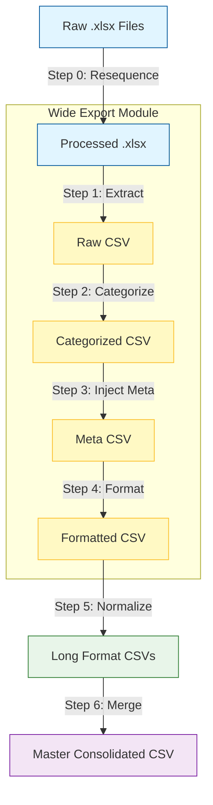

#  Pipeline Execution Flow

This document defines the **end-to-end execution flow** for the  data processing pipeline. It creates a standardized, reproducible process that transforms raw Excel data into consolidated, analysis-ready datasets in a "one execute" workflow.

---

##  Executive Summary: The One-Click Flow

The pipeline is designed to be executed in a strict sequence to ensure data integrity.

**Command Sequence:**
1. **Step 0: Resequence** (Clean Index, Split Sheets)
2. **Step 1: Excel Extraction** (Parse Tables)
3. **Step 2: Category Separation** (Add Context)
4. **Step 3: Metadata Injection** (Add Source/Section)
5. **Step 4: Data Formatting** (Clean Values)
6. **Step 5: Normalize** (Long Format)
7. **Step 6: Merge** (Consolidate)
8. **Step 7: View Gen** (Table Views)

---

##  Pipeline Architecture



---

## ️ Detailed Execution Plan

### 1. Index Sheet Re-sequencing (Step 0)
**Objective:** Ensure every table has a unique ID and physical sheet.  
**Script:** `scripts/test_index_resequencer.py`  
**Input:** `data/processed/*.xlsx`  
**Output:** `data/processed/*.xlsx` (Modified in-place with re-sequencing)  
**Command:**
```bash
python3 scripts/test_index_resequencer.py --mode all --dir data/processed
```

### 2. Wide Export Module (Steps 1-4)
**Objective:** Create human-readable CSVs with all metadata.
- **Step 1:** Excel Extraction
- **Step 2:** Category Separation
- **Step 3:** Metadata Injection
- **Step 4:** Data Formatting ($, %)

**Input:** `data/processed/*.xlsx`  
**Output:** `data/csv_output/[WorkbookName]/*.csv` (Formatted Wide CSVs)

**Command:**
```bash
python3 -m src.infrastructure.extraction.exporters.run_csv_export
```

### 3. Normalized Export (Step 5)
**Objective:** Create machine-readable CSVs for database ingestion (Long Format).  
**Script:** `src.infrastructure.extraction.exporters.run_csv_export` (with flag)  
**Configuration:** `enable_data_normalization=True`  
**Input:** `data/csv_output/[WorkbookName]/*.csv` (Implicitly re-processed from xlsx or formatted CSV state)  
**Output:** `data/csv_output_normalized/[WorkbookName]/*.csv` (Long Format)

**Command:**
```bash
python3 -c "
from src.infrastructure.extraction.exporters.csv_exporter import get_csv_exporter
from pathlib import Path
exporter = get_csv_exporter(
    enable_data_normalization=True,
    output_dir=Path('data/csv_output_normalized')
)
exporter.export_all()
"
```
**Output:** Normalized CSVs in `data/csv_output_normalized/`.

### 4. Merge & Consolidation (Step 6)
**Objective:** Combine all normalized data into a single master file.  
**Script:** `src.pipeline.merge_csv_pipeline`

- **Step 6a:** Merge per Source → `[Source]_consolidated.csv`
- **Step 6b:** Master Merge → `Master_Consolidated.csv`

**Input:** `data/csv_output_normalized/**/*.csv`  
**Output:** `data/consolidate/Master_Consolidated.csv`

**Command:**
```bash
python3 -m src.pipeline.merge_csv_pipeline --base-dir data/csv_output_normalized --output-dir data/consolidate
```

---

## ️ The Complete Orchestrator

The entire pipeline is orchestrated by a dedicated script that runs all steps in sequence.

**Script Path:** `src/pipeline/orchestrate_pipeline.py`

**Usage:**
```bash
python3 -m src.pipeline.orchestrate_pipeline
```

**Workflow Logic:**
1. **Validation:** Checks environment and paths.
2. **Step 0 (Resequence):** Runs `scripts/test_index_resequencer.py` to prepare input files.
3. **Steps 1-4 (Wide Export):** Runs `run_csv_export` to generate standard formatted CSVs.
4. **Step 5 (Normalized Export):** Runs exporter with `enable_data_normalization=True` to generate long-format CSVs.
5. **Step 6 (Merge):** Runs `src.pipeline.merge_csv_pipeline` to consolidate normalized data.
6. **Step 7 (View Gen):** Runs `src.table_view.run_table_view` to generate individual table views.

**Failure Handling:**
The orchestrator uses a **stop-on-failure** policy. If any step returns a non-zero exit code, the pipeline terminates immediately to prevent data corruption.

---

## ️ Idempotency & Standards

- **Idempotent:** All steps can be re-run safely.
    - Index resequencer checks for existing IDs.
    - Exporters overwrite output files (clean state).
    - Merge pipeline overwrites master file.
- **No Duplicates:**
    - Step 0 (Resequencing) specifically removes duplicate references to the same table.
    - Step 6 (Merge) involves deduplication logic to merge identical rows.
- **Error Handling:** Stop-on-fail architecture ensures bad data doesn't propagate.

