# Source and Destination Plan - Consolidated

This document consolidates all source and destination information for each implementation step in the  pipeline.

---

## Table of Contents

0. [Index Sheet Re-sequencing (Prerequisite)](#0-index-sheet-re-sequencing-prerequisite)
1. [Excel to CSV Migration](#1-excel-to-csv-migration)
2. [Category Separation](#2-category-separation)
3. [Metadata Column Injection](#3-metadata-column-injection-source-section-table-title)
4. [Data Formatting](#4-data-formatting)
5. [Date Column Value Separation](#5-date-column-value-separation-wide--long-format)
6. [Merge Across CSV](#6-merge-across-csv)
7. [Table Time-Series View Generation](#7-table-time-series-view-generation)

---

## 0. Index Sheet Re-sequencing (Prerequisite)

> **Full Documentation:** [index_sheet_mapping_table.md](../index_sheet_mapping/index_sheet_mapping_table.md)

**Purpose:** Re-sequence xlsx Index sheets based on unique (Section + Table Title) and physically split multi-table sheets.

### Source Files (Input)
- **Location:** `./data/processed/*.xlsx`
- **Files:** 4 xlsx files (10k1224, 10q0325, 10q0624, 10q0925)

### Destination Files (Output)
- **Location:** Same xlsx files (modified in-place)
- **Changes:**
  - Index sheet Link and Table_ID columns updated
  - Sheets renamed to match new IDs
  - Multi-table sheets split into separate physical sheets
  - Back links updated

### Key Logic
| Pattern | Action |
|---------|--------|
| Same Section+Title | Add `_n` suffix (4, 4_1, 4_2) |
| Different Section+Title | Assign new sequential ID (5) |
| Multi-page continuous table | Consolidate to 1 entry |
| Single metadata + multiple data blocks | Split by unit indicator patterns |

---


## 1. Excel to CSV Migration

### Source Files (Input)

**Location:** `./data/processed/*.xlsx`

**Files:**
- `10k1224_tables.xlsx` (~433 KB, ~162 sheets)
- `10q0325_tables.xlsx` (~312 KB, ~160 sheets)
- `10q0624_tables.xlsx` (~331 KB, ~160 sheets)
- `10q0925_tables.xlsx` (~327 KB, ~160 sheets)

**Structure:**
- **Index Sheet** - Quick reference with columns: `Source`, `PageNo`, `Table_ID`, `Location_ID`, `Section`, `Table Title`, `Link`
- **Table Sheets** (numbered: 1, 2, 3, ...) - Each contains one or more tables with metadata blocks

**Metadata Structure Per Table:**
| Key | Description | Mandatory |
|-----|-------------|-----------|
| `Category (Parent)` | Parent category of line items | No |
| `Line Items` | Comma-separated list of row labels | No |
| `Product/Entity` | Product or entity names | No |
| `Column Header` | Column headers (e.g., `Q1-2025, Q2-QTD-2025, Q2-YTD-2025, YTD-2025`) | No |
| `Table Title` | Title of the table | **Yes** |
| `Source(s)` | Source file and page reference | **Yes** |

### Destination Files (Output)

**Location:** `./data/csv_output/[workbook_name]/`

**Directory Structure:**
```
./data/csv_output/
 10q0925/
    Index.csv           # Enhanced Index with all metadata columns
    1.csv               # Table sheet 1
    2.csv               # Table sheet 2
    2_table_1.csv       # For multi-table sheets
    2_table_2.csv       # For multi-table sheets
    ...
 10q0624/
 10q0325/
 10k1224/
```

**Enhanced Index CSV Schema:**
| Column Name | Source | Description |
|-------------|--------|-------------|
| `Source` | Original Index | Source PDF filename |
| `PageNo` | Original Index | Page number |
| `Table_ID` | Original Index | Table identifier |
| `Location_ID` | Original Index | Location identifier |
| `Section` | Original Index | Section name |
| `Table Title` | Original Index | Table title from Index |
| `Link` | Original Index | Link to sheet |
| `Table_Index` | **NEW** | Index of table within sheet (1, 2, 3...) |
| `Category_Parent` | **NEW** | From metadata |
| `Line_Items` | **NEW** | From metadata |
| `Product_Entity` | **NEW** | From metadata |
| `Column_Header` | **NEW** | From metadata |
| `Table_Title_Metadata` | **NEW** | Table title from metadata block |
| `Sources_Metadata` | **NEW** | Source(s) from metadata block |
| `CSV_File` | **NEW** | Path to exported CSV file |

**Table CSV Format:**
```csv
$ in millions,Q3-QTD-2025,Q3-QTD-2024,Q3-YTD-2025,Q3-YTD-2024
Net revenues,18224,15383,52755,45538
Adjustment for mark-to-market losses (gains) on DCP,-248,-239,-476,-372
Adjusted Net revenues-non-GAAP,17976,15144,52279,45166
```

---

## 2. Category Separation

### Source Files (Input)

**Location:** `./data/csv_output/[workbook_name]/[table_name].csv`

**Format:** Standard CSV files exported from Excel workbooks (from Step 1)

**Examples:**
- `./data/csv_output/10q0925/2_table_1.csv`
- `./data/csv_output/10q0925/82_table_1.csv`
- `./data/csv_output/10k1224/1.csv`

**Input Structure:**
```csv
$ in millions,Q3-QTD-2025,Q3-QTD-2024,Q3-YTD-2025,Q3-YTD-2024
,,,,
Consolidated results,,,,
Net revenues,18224,15383,52755,45538
...
```

### Destination Files (Output)

**Location:** Same as source - files are **transformed in-place** during CSV export

**Format:** Enhanced CSV with Category column

**Examples:**
- `./data/csv_output/10q0925/2_table_1.csv` (same file, transformed)
- `./data/csv_output/10q0925/82_table_1.csv` (same file, transformed)

**Output Structure:**
```csv
Category,Product/Entity,Q3-QTD-2025,Q3-QTD-2024,Q3-YTD-2025,Q3-YTD-2024
Consolidated results,Net revenues,18224,15383,52755,45538
Consolidated results,Earnings per share,2.8,1.88,7.53,5.73
Consolidated financial measures,ROE,0.18,0.131,0.165,0.135
...
```

**Metadata Update:**
- `./data/csv_output/[workbook_name]/Index.csv` - `Category_Parent` column updated with extracted categories

---

## 3. Metadata Column Injection (Source, Section, Table Title)

### Source Files (Input)

**Primary Source:** `./data/csv_output/[workbook_name]/[table_name].csv`
- CSV files after Category Separation
- Contains: `Category`, `Product/Entity`, `<period headers>`

**Metadata Source:** `./data/csv_output/[workbook_name]/Index.csv`
- Enhanced Index with full metadata columns
- Key columns used: `Section`, `Table Title`, `Sources_Metadata`, `CSV_File`

**Example Input Files:**
- `./data/csv_output/10q0925/2_table_1.csv`
- `./data/csv_output/10k1224/6.csv`

**Input Structure (Before Injection):**
```csv
Category,Product/Entity,Q3-QTD-2025,Q3-QTD-2024
Consolidated results,Net revenues,18224,15383
Consolidated results,ROE,0.18,0.131
```

### Destination Files (Output)

**Location:** Same as source - files are **transformed in-place** during CSV export

**Format:** CSV with Source, Section, and Table Title columns prepended

**Output Structure (After Injection):**
```csv
Source,Section,Table Title,Category,Product/Entity,Q3-QTD-2025,Q3-QTD-2024
10q0925.pdf_pg7,Business Segment Results,Selected Financial Information,Consolidated results,Net revenues,18224,15383
10q0925.pdf_pg7,Business Segment Results,Selected Financial Information,Consolidated results,ROE,0.18,0.131
```

**Column Order:**
```
Source | Section | Table Title | Category | Product/Entity | <period headers>...
```

**Metadata Sources:**
- **Source** → From `Sources_Metadata` in Index.csv (e.g., `10q0925.pdf_pg7, 2025 Q3`)
- **Section** → From `Section` in Index.csv
- **Table Title** → From `Table Title` in Index.csv (fallback: `Table_Title_Metadata`)

---

## 4. Data Formatting

### Source Files (Input)

**Primary Source:** `./data/csv_output/[workbook_name]/[table_name].csv`
- CSV files after Category Separation and Metadata Injection
- Contains: `Source`, `Section`, `Table Title`, `Category`, `Product/Entity`, `<period headers>`
- May have partial formatting: `$ (717)`, `17.4 %`, `(5)%`
- May lack formatting: `18224`, `-248`, `0.18`

**Example Input Files:**
- `./data/csv_output/10q0925/2_table_1.csv`
- `./data/csv_output/10q0925/144_table_1.csv`
- `./data/csv_output/10k1224/4.csv`

**Input Structure (Before Formatting):**
```csv
Source,Section,Table Title,Category,Product/Entity,Q3-QTD-2025,Q3-QTD-2024
10q0925.pdf_pg7,Business Segment Results,Selected Financial Information,Consolidated results,Net revenues,18224,15383
10q0925.pdf_pg7,Business Segment Results,Selected Financial Information,Consolidated results,ROE,0.18,0.131
```

### Destination Files (Output)

**Location:** Same as source - files are **transformed in-place** during CSV export

**Format:** CSV with properly formatted data values (headers unchanged)

**Output Structure (After Formatting):**
```csv
Source,Section,Table Title,Category,Product/Entity,Q3-QTD-2025,Q3-QTD-2024
10q0925.pdf_pg7,Business Segment Results,Selected Financial Information,Consolidated results,Net revenues,$18,224,$15,383
10q0925.pdf_pg7,Business Segment Results,Selected Financial Information,Consolidated results,ROE,18.0%,13.1%
```

**Output Characteristics:**
- **Currency:** `$18,224` (with $ symbol and thousand separators)
- **Percentage:** `17.4%` (with % symbol, normalized spacing)
- **Negative:** `($1,234)` (parenthetical notation)
- **Special values:** `N/M`, `-` (preserved as-is)
- **Headers:** `Q3-QTD-2025`, `% change` (unchanged - NOT formatted)

---

## 5. Date Column Value Separation (Wide → Long Format)

> **Full Documentation:** [date_column_value_separation_plan.md](../column_data_populated/date_column_value_separation_plan.md)

**Purpose:** Transform CSV data from wide format (period headers as columns) to normalized long format with separate Date, Header, and Data Value columns.

### Source Files (Input)

**Location:** `./data/csv_output/[workbook_name]/[table].csv`

**Format:** CSV files after Step 4 (Data Formatting)

**Current Schema:**
| Column | Example |
|--------|---------|
| `Source` | `10q0925.pdf_pg7` |
| `Section` | `Business Segment Results` |
| `Table Title` | `Selected Financial Information` |
| `Category` | `Consolidated results` |
| `Product/Entity` | `Net revenues` |
| `<period headers>...` | `Q3-QTD-2025`, `Q3-QTD-2024`, `Q3-YTD-2025`, etc. |

**Example Input:**
```csv
Source,Section,Table Title,Category,Product/Entity,Q3-QTD-2025,Q3-QTD-2024,Q3-YTD-2025,Q3-YTD-2024
10q0925.pdf_pg7,Business Segment Results,Selected Financial Information,Consolidated results,Net revenues,"$18,224","$15,383","$52,755","$45,538"
```

### Destination Files (Output)

**Location:** `./data/csv_output_normalized/[workbook_name]/[table].csv`

**New Schema:**
| Column | Description | Example |
|--------|-------------|---------|
| `Source` | Source file reference | `10q0925.pdf_pg7` |
| `Section` | Section name | `Business Segment Results` |
| `Table Title` | Table title | `Selected Financial Information` |
| `Category` | Parent category | `Consolidated results` |
| `Product/Entity` | Row identifier | `Net revenues` |
| `Dates` | **NEW** - Full period identifier from header | `Q3-QTD-2025` |
| `Header` | **NEW** - Suffix text after period (if any) | `IS`, `WM`, or *(empty)* |
| `Data Value` | **NEW** - Cell value | `$18,224` |

**Example Output (Simple Periods):**
```csv
Source,Section,Table Title,Category,Product/Entity,Dates,Header,Data Value
10q0925.pdf_pg7,Business Segment Results,Selected Financial Information,Consolidated results,Net revenues,Q3-QTD-2025,,"$18,224"
10q0925.pdf_pg7,Business Segment Results,Selected Financial Information,Consolidated results,Net revenues,Q3-QTD-2024,,"$15,383"
```

**Example Output (Periods with Suffix):**
```csv
Source,Section,Table Title,Category,Product/Entity,Dates,Header,Data Value
10q0925.pdf_pg19,Liquidity Resources,Total Assets by Segment,Assets,Cash,Q3-2025,IS,"$50,000"
10q0925.pdf_pg19,Liquidity Resources,Total Assets by Segment,Assets,Cash,Q3-2025,WM,"$30,000"
```

### Key Logic

| Column Header | Dates | Header |
|--------------|-------|--------|
| `Q3-QTD-2025` | `Q3-QTD-2025` | *(empty)* |
| `Q3-2025 IS` | `Q3-2025` | `IS` |
| `Q3-2025 WM` | `Q3-2025` | `WM` |
| `MS/PF` | `MS/PF` | *(empty)* |

---

## 6. Merge Across CSV

> **Full Documentation:** [merge_across_csv_in_folder_plan.md](../merge_across_csv_in_folder/merge_across_csv_in_folder_plan.md)

**Purpose:** Consolidate all individual normalized CSV files into master datasets for analysis.

### Source Files (Input)

**Location:** `./data/csv_output_normalized/[source_dir]/*.csv`

**Files:**
- Individual normalized table CSVs (e.g., `10q0925/1.csv`, `10q0925/2.csv`)
- **Excludes:** `Index.csv`

### Destination Files (Output)

**1. Individual Source Consolidated:**
- **Location:** `./data/csv_output_normalized/[source_dir]/[source_dir]_consolidated.csv`
- **Example:** `./data/csv_output_normalized/10q0925/10q0925_consolidated.csv`

**2. Master Consolidated:**
- **Location:** `./data/consolidate/Master_Consolidated.csv`
- **Content:** Aggregation of all individual consolidated files.

### Key Logic

- **BOM Handling:** Uses `utf-8-sig` to handle Byte Order Marks.
- **Empty Checks:** Skips empty or header-only files.
- **Schema Validation:** Ensures all inputs match target schema.


---

## 7. Table Time-Series View Generation

> **Full Documentation:** [table_timeseries_view.md](../table_view/table_timeseries_view.md), [master_table_index_plan.md](../table_view/master_table_index_plan.md)

**Purpose:** Decompose the master consolidated dataset into individual, time-series formatted CSV files for each unique table.

### Source Files (Input)

**Primary Source:** `./data/consolidate/Master_Consolidated.csv`
- The unified dataset containing all tables.

### Destination Files (Output)

**1. Master Table Index:**
- **Location:** `./data/table_views/Master_Table_Index.csv`
- **Content:** Catalog of all available tables with metadata (ID, Source, Section, Title, etc.).

**2. Individual Table Views:**
- **Location:** `./data/table_views/[Table_ID].csv` (e.g., `TBL_001.csv`)
- **Content:** Time-series matrix for a specific table.
- **Structure:**
    - **Rows:** `Source`, `Dates`, `Header`
    - **Columns:** `Category - Product/Entity`
    - **Values:** `Data Value`

### Key Logic

- **Index Generation:** Groups by `Section` + `Table Title`. Assigns sequential IDs based on original order.
- **View Generation:** Filters master data by ID and pivots to wide format.

---

## Pipeline Orchestration (Step 0-7)
**Script:** `src.pipeline.orchestrate_pipeline`
**Status:**  Complete
**Purpose:** Executes all steps in strict sequence.

---

## Processing Flow Summary

```mermaid
graph LR
    A[./data/processed/*.xlsx] -->|Step 1: Excel to CSV| B[./data/csv_output/*/raw.csv]
    B -->|Step 2: Category Separation| C[./data/csv_output/*/categorized.csv]
    C -->|Step 3: Metadata Injection| D[./data/csv_output/*/with_metadata.csv]
    D -->|Step 4: Data Formatting| E[./data/csv_output/*/formatted.csv]
    E -->|Step 5: Normalization| F[./data/csv_output_normalized/*.csv]
    F -->|Step 6: Merge| G[./data/consolidate/Master_Consolidated.csv]
    G -->|Step 7: View Gen| I[./data/table_views/*.csv]
    
    H[Index.csv] -->|Lookup| C
    
    style A fill:#e1f5ff
    style B fill:#fff4e1
    style C fill:#e8f5e9
    style D fill:#ffe0b2
    style E fill:#f3e5f5
    style F fill:#fce4ec
    style G fill:#e1bee7
    style H fill:#e3f2fd
    style I fill:#eeeeee

```



---

## Key Notes

1. **In-Place Transformation**: Steps 2, 3, and 4 transform files in-place rather than creating new files
2. **Metadata Updates**: Each step may update the `Index.csv` file with additional metadata
3. **Sequential Processing**: Steps must be executed in order (0 → 1 → 2 → 3 → 4 → 5)
4. **File Naming**: Multi-table sheets use naming pattern `[sheet_id]_table_[n].csv`
5. **Metadata Fallback**: Step 4 logs warnings for missing metadata but continues with empty values

---

## Implementation Files Reference

### Step 0: Index Sheet Re-sequencing
- **Plan:** [index_sheet_mapping_table.md](../index_sheet_mapping/index_sheet_mapping_table.md)
- **Module:** `src/index_sheet_resequencer.py`
- **Status:**  Complete

### Step 1: Excel to CSV Migration
- **Module:** `src/infrastructure/extraction/exporters/csv_exporter/exporter.py`
- **Status:**  Complete

### Step 2: Category Separation
- **Module:** `src/infrastructure/extraction/exporters/csv_exporter/category_separator.py`
- **Integration:** `csv_exporter/exporter.py` (via `enable_category_separation` parameter)
- **Status:**  Complete

### Step 3: Metadata Column Injection
- **Module:** `src/infrastructure/extraction/exporters/csv_exporter/metadata_injector.py`
- **Integration:** `csv_exporter/exporter.py` (via `enable_metadata_injection` parameter)
- **Plan:** [section_tabletitle_plan.md](../column_data_populated/section_tabletitle_plan.md)
- **Status:**  Complete

### Step 4: Data Formatting
- **Module:** `src/infrastructure/extraction/exporters/csv_exporter/data_formatter.py`
- **Integration:** `csv_exporter/exporter.py` (via `enable_data_formatting` parameter)
- **Status:**  Complete

### Step 5: Date Column Value Separation
- **Plan:** [date_column_value_separation_plan.md](../column_data_populated/date_column_value_separation_plan.md)
- **Module:** `src/infrastructure/extraction/exporters/csv_exporter/data_normalizer.py`
- **Integration:** `csv_exporter/exporter.py` (via `enable_data_normalization` parameter)
- **Integration:** `csv_exporter/exporter.py` (via `enable_data_normalization` parameter)
- **Status:**  Complete

### Step 6: Merge Across CSV
- **Plan:** [merge_across_csv_in_folder_plan.md](../merge_across_csv_in_folder/merge_across_csv_in_folder_plan.md)
- **Module:** `src/pipeline/merge_csv_pipeline.py`
- **Status:**  Complete

### Step 7: Table Time-Series View Generation
- **Plan:** [table_timeseries_view.md](../table_view/table_timeseries_view.md)
- **Module:** `src/table_view/run_table_view.py`, `src/table_view/master_table_index_generator.py`, `src/table_view/table_view_generator.py`
- **Status:**  Complete

